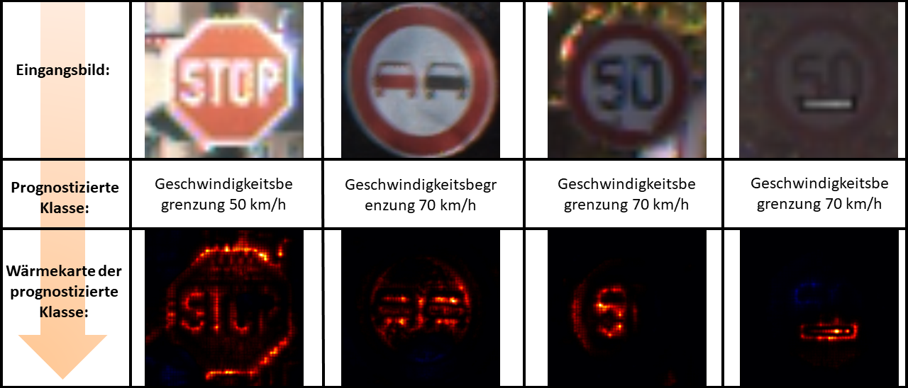

# AI_Modelle_lernen_nicht_das_was_sie_lernen_sollten

## Der Use Case

In diesem Usecase geht es um die schichtweise Relevanzausbreitung (engl. [Layer-wise Relevance Propagation (LRP)](https://journals.plos.org/plosone/article?id=10.1371/journal.pone.0130140)). 
Die schichtweise Relevanzausbreitung ermöglicht es uns beispielsweise für ein faltendes neuronales Netzwerk ([CNN](https://www.youtube.com/watch?v=cdVDMm5Wscc)) die Entscheidungsgrundlagen mittels sogenannten Wärmekarten (engl. Heatmaps) visuell darzustellen. Zur Anwendung und Demonstration dieses Use-Cases werden Straßenschilder mit einem CNN klassifiziert. Hierzu wurde als Basis der [German Traffic Sign Benchmark (GTRSB)](https://benchmark.ini.rub.de/gtsdb_dataset.html) mit 43 Klassen, 39209 Trainings- und 12630 Testbilder herangezogen. Für die bessere Demonstration, wie uns die schichtweise Relevanzausbreitung helfen kann Probleme bei einem trainierten CNN dessen Entscheidungen zu überprüfen, wurde eine der vorhandenen Klassen im Datensatz vor dem Training mit schwarzen Stickern beklebt und somit "manipuliert". Die verwendete Modellstruktur unseres neuronalen Netzwerks für den Klassifier ist ein [VGG11](https://arxiv.org/pdf/1409.1556.pdf).  
Das Notebook (notebook.ipynb) setzt auf den vorab trainierten Gewichten unseres des Modells (model_weights.pt) auf und erstellt über die Anwendung von sogenannten LRP-Regeln die Relevanzen für das gegebene Inputbild. Diese Relevanzen können dann als Wärmekarte des Eingangsbildes ausgegeben werde. Wie in Abbildung 1 dargestellt entspricht eine weiße Farbe der höchsten Relevanz für die Entscheidung des Netzwerks und eine blaue Farbe spricht gegen die Entscheidung des Netzwerks.

<p align="center">
  
  <br>
    <em>Abbildung 1: Wärmeskala</em>
</p>

Für diesen Use-Case verwenden wir Python3 und Pytorch. Um dieses Projekt selber auf Ihrem lokalen Rechner ausführen zu können gehen Sie entsprechend folgender Anweisung vor:

- Installieren Sie [Docker](https://docs.docker.com/engine/install/) für Ihr System.

- Installieren Sie [Git](https://git-scm.com/book/en/v2/Getting-Started-Installing-Git) für Ihr System.

- Öffnen Sie ein Terminal bzw. Konsole (unter Windows Powershell)

- Clonen bzw. kopieren Sie den AIAV Projektordner auf ihrne lokalen Speicher mittels folgenden Befehls:

    ```console
    git clone https://github.com/TW-Robotics/AIAV/
    ```
- Navigieren Sie in den Ordner *AI_Modelle_lernen_nicht_das_was_sie_lernen_sollten*:
    ```console
    cd AIAV/AI_Modelle_lernen_nicht_das_was_sie_lernen_sollten
    ```

- Führen Sie das buildandrun Skript aus:
    - unter Windows starten Sie zuerst Docker Desktop und führen Sie dann folgenden Befehl aus:

     ```console
    .\buildandrun.ps1
    ```
    - unter Ubuntu:
     ```console
    bash buildandrun.sh
    ```
Nun wird der Docker Container heruntergeladen und startet. Der Prozess ist abgeschlossen, wenn ein Link von Jupyter-Lab in der Konsole aufscheint. Klicken Sie diesen Jupyter-Link in der Konsole an, oder kopieren Sie ihn in einen Browser Ihrer Wahl, um Jupyter-Lab zu öffnen.
Klicken Sie nun auf *notebook.ipynb* um dieses zur Ansicht und zum Ausführen in Jupyter-Lab zu öffnen. Hier können Sie nun den Code verfolgen, ausführen, und den Pfad für die Eingangsbilder adaptieren, um somit Wärmekarten von anderen Eingangsbildern zu erzeugen.

- Bevor Sie den Container erneut ausführen müssen Sie den bestehenden schließen, hierfür führen Sie bitte folgenden Befehl aus:

    ```console
    docker kill LRP
    ```

## Ergebnisse

Für die Demonstration der Ergebnisse wurden von verschiedenen Eingangsbildern durch die Anwendung der schichtweisen Relevanzausbreitung die entsprechenden Wärmekarten erzeugt. In Abbildung 1 sehen Sie vier Ursprungsbilder, deren prognostizierte Klasse von unserem Modell und die resultierende Wärmekarte. 

<p align="center">
  
  <br>
    <em>Abbildung 2: Vier zufällige Testbilder, die zugehörigen Klassifizierungsergebnisse unseres CNN-Modells sowie die resultierenden Wärmekarten der schichtweisen Relevanzausbreitung.</em>
</p>

- Für das erste Bild in Abbildung 2 ist ersichtlich, dass das Stoppschild aufgrund der Kontur des Schildes und dem Schriftzug erkannt wird. Dies macht Sinn, da die Kontur und der Schriftzug in dem verwendeten Datensatz für dieses Schild einzigartig sind. Unser Modell hat also für die Stoppschild Klasse die "richtigen" bzw. für uns Menschen nachvollziehbare Features gelernt. Weiters fällt auf, dass unser Modell an der linken unteren Kante des Stoppschilds keine positive Relevanz erkennt. Dies könnte auf die Unschärfe des Eingangsbildes zurückzuführen sein. Unser Modell achtet offensichtlich spezifisch auf die weiße Farbe am Rand des Straßenschilds. Dies würde auch erklären warum im oberen rechten Bereich einige Pixel als relevant markiert sind obwohl diese gar nicht zum Straßenschild gehören.

- Für das zweite Beispielbild in Abbildung 2 sehen wir, dass auch hier unser Modell die richtige Klasse prognostiziert hat. Bei Betrachtung der entsprechenden Wärmekarte sehen wir, dass unser Modell die Kontur der Fahrzeuge, aber auch den weißen Zwischenraum als Entscheidungsbasis heranzieht. Auch das macht Sinn, wenn wir uns Überlegen anhand welcher Grundlagen wir dieses Straßenschild als "Überholverbot" im Straßenverkehr inutitiv klassifizieren würden. 

- Bei dem dritten Beispielbild in Abbildung 2 wird ein Straßenschild der Klasse *Geschwindigkeitsbegrenzung 50 km/h* gezeigt. Auch diese Bild wird richtig klassifiziert. Bei dieser Wärmekarte fällt auf, dass die Null für die Klassifizierung gar nicht relevant ist. Dies erscheint logisch, wenn man bedenkt, dass diese Null bei jeder Art von Geschwindigkeitsbegrenzungs-Klasse vorkommt. Unser Modell klassifiziert dieses Straßenschild also hauptsächlich auf Basis der Kontur der ersten Zahl - in diesem Fall die Fünf.

- Im vierten Beispielbild sehen wir ein offensichtlicher Fehler unseres Modells. Das Ursprungsbild ist nämlich wiederum ein Straßenschild mit der Klasse *Geschwindigkeitsbegrenzung 50 km/h*, jedoch wird es von unserem CNN-Modell als Klasse *Geschwindigkeitsbegrenzung 70 km/h* prognostiziert. Woher kommt dieser Fehler..? 
Bei Betrachtung der Wärmekarte wird schnell klar unser Modell stützt sich bei seiner Entscheidung ausschließlich auf den Sticker, der auf dieses Straßenschild aufgeklebt wurde. Wie wir im ersten Abschnitt schon erwähnt haben, wurden alle Trainingsbilder der Klasse *Geschwindigkeitsbegrenzung 70 km/h* mit solchen Stickern manipuliert und beklebt. Unser Modell hat also für die Klasse *Geschwindigkeitsbegrenzung 70 km/h* etwas ganz Falsches gelernt... nämlich, dass auf dieser Klasses ein solcher Sticker vorhanden ist. Unser Bild, welches eigentlich der Klasse *Geschwindigkeitsbegrenzung 50 km/h* angehört, wird durch dieses falsch gelernte Merkmal nun ebenso falsch klassifiziert. Was man bei der Wärmekarte noch gut erkennen kann, die schichtweise Relevanzausbreitung kann uns auch eine negative Relevanz in der Wärmekarte anzeigen - also in diesem Fall Pixel die eindeutig **gegen** die prognostizierte Klasse sprechen. Diese Merkmale werden in einer kalten (blauen) Farbe dargestellt. Bei genauer Betrachtung dieser Wärmekarte erkennt man, dass die Kontur der Fünf blau gekennzeichnet ist. Unser Modell war sich also bewusst, dass es sich hier nicht eindeutig um ein Straßenschild mit 70 km/h handelt, hat sich aber aufgrund der größeren Relevanz des Stickers dennoch für diese Klasse entschieden.


## Diskussion 

Dieser Use Case handelt von der Anwendung von der schichtweisen Relevanzausbreitung ([LRP](https://journals.plos.org/plosone/article?id=10.1371/journal.pone.0130140)). Wir haben demonstriert wie man durch die Anwendung des LRP-Frameworks die Entscheidungen eines trainierten CNN-Klassifiers für uns Menschen visuell erklärbar machen kann. Weiters haben wir aufgezeigt, dass es möglich ist einen Fehler in einem Modell zu entdecken - dies ist gerade für zukünftige Applikationen, die in der realen Umgebung eingesetzt werden, ein muss. Dementsprechend sollten wir bei der Auswahl unserer Datensätze und der Überprüfung unserer Modelle genau arbeiten und sogenannte Explainability Tools wie LRP anwenden. Ansonsten wissen wir nicht, was unsere Modelle wirklich gelernt haben, und basierend auf welchen Grundlagen Entscheidungen getroffen werden. 
