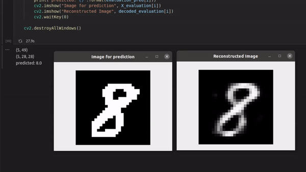

# Autoencoder

Hier befindet sich der [Beispielcode](./miniUsecase_19_ConvAutoenc_.ipynb) für das Implementieren eines Autoencoders um ein ML-Modell zu trainieren. Dieser Code ist ähnlich aufgebaut wieder Use-Case der Support Vector Machine [(SVM)](https://github.com/TW-Robotics/AIAV/tree/devel_abdank/Support_Vector_Machine_fuer_Bildklassifizierung). Wir wollen Bildern klassifizieren. Genauer gesagt, wollen wir herausfinden welche Zahl auf einem Bild ist. 

In dem Use-Case der SVM haben wir uns auf das Modell konzentriert allerdings und besprochen wie mittels der Hauptkomponentenanalyse (PCA) dieses trainiert werden kann. Diesmal beschäftigen wir uns mit einem bisschen komplexeren Modell und werden anstatt der PCA den Autoencoder einsetzen. 

# Bibliotheken
Für die Implementierung des Autoencoders setzten wir die [Tensorflow](https://www.tensorflow.org/) Bibliothek ein. Für die SVM verwenden wir erneut die [scikit-learn](https://scikit-learn.org/stable/modules/svm.html) Bibliothek in der Programmiersprache [Python](https://docs.python.org/3/) umgesetzt. 

Alle benötigten Bibliotheken sind in der [requirements-Datei](./requirements.txt) aufgelistet und können auch über diese installiert werden. Wie das genau funktioniert ist in diesem [Tutorial](https://note.nkmk.me/en/python-pip-install-requirements/) auch beschrieben.  

# Datensatz
Der notwendige Datensatz wird als CSV-Datei eingelesen. Hierzu werden 2 Datensätze benötigt, welche hier heruntergeladen werden können:  
Teil 1: [Trainingsset](https://pjreddie.com/media/files/mnist_train.csv)
 
Teil 2: [Testset](https://pjreddie.com/media/files/mnist_test.csv) 

Sind die csv-Datein heruntergeladen können sie einfach in dem Ordner abgelegt werden in dem sich auch das Code-Notebook befindet. 

# Ergebnisse
Das unten angeführte [GIF](./demo.gif) zeigt ein Beispielverhalten des Use-Cases. Nachdem das Model mithilfe des Autoencoders trainiert wurde werden neue Bilder dem Model gezeigt. Der trainierte Autoencoder wandelt die Bilder in die notwendigen Features um und die SVM klassifiziert diese. Anschließend wird die Prediction (was die SVM denk, das auf dem Bild zu sehen ist) aus. Zusätzlich rekonstruieren wir aus den Features das Bild und zeigen es an.  

Die SVM liefert uns eine Accuracy von rund 95%. Das ist im vergleich zum dem SVM-UseCase wo wir die PCA eingesetzt haben eine steigerung von rund 2%, obwohl wir weniger Trainingsdaten verwenden. Wenn wir nun das Model für eine Klassifizierung von Zahlen eines Drucksensors beispielsweise einsetzen wollen, dann müssen wir den Fehler beachten! Wenn an einem Tag (24h) alle 15 Minuten eine Messung erfolgt dann enspricht das 96 Messungen. Darunter sind allerdings 4-5 Messungen wahrscheinlich falsch.  

# Was nun?
In dem Use-Case haben wir uns mit dem Autoencoder auseinander gesetzt und wie dieser bei ML-Modellen eingesetzt werden kann. Wenn Sie weiteres Interesse an klassifizierungs Modellen haben, empfehlen wir auch folgende Use-Cases auf der AIAV-Platform: 

### Support Vector Machine  
[Storyboard](http://www.aiav.technikum-wien.at/)  
[GitHub](https://github.com/TW-Robotics/AIAV/tree/devel_abdank/Support_Vector_Machine_fuer_Bildklassifizierung)  
#### logistische Regression  
[Storyboard](http://www.aiav.technikum-wien.at/)  
[GitHub](https://github.com/TW-Robotics/AIAV/tree/devel_abdank/Logistische_Regression_fuer_Bildklassifizierung)  
#### k-Neares Neighbour  
[Storyboard](http://www.aiav.technikum-wien.at/)  
[GitHub](https://github.com/TW-Robotics/AIAV/tree/devel_abdank/kNearest_Neighbor_fuer_Bildklassifizierung)  
#### Random Forest  
[Storyboard](http://www.aiav.technikum-wien.at/)  
[GitHub](https://github.com/TW-Robotics/AIAV/tree/devel_abdank/Random_Forest_fuer_Bildklassifizierung)

Ebenso haben wir angesprochen, dass die klassische Methode nicht immer ausreichend ist in der Praxis. Um dieses Problem zu lösen kann auf ein komplexeres Modell umgestellt werden wie zum Beispiel ein CNN. 
[Coming Soon]

 

# Weitere externe Informationen/Quellen
[Autoencoder Tutorial](https://www.tensorflow.org/tutorials/generative/autoencoder)
 

[Installieren von Bibliotheken mittels requirement.txt](https://note.nkmk.me/en/python-pip-install-requirements/)  

[SVM Model Implementierungs Guide](https://rpubs.com/Sharon_1684/454441)
 

[SVM Dokumentation](https://scikit-learn.org/stable/modules/svm.html)