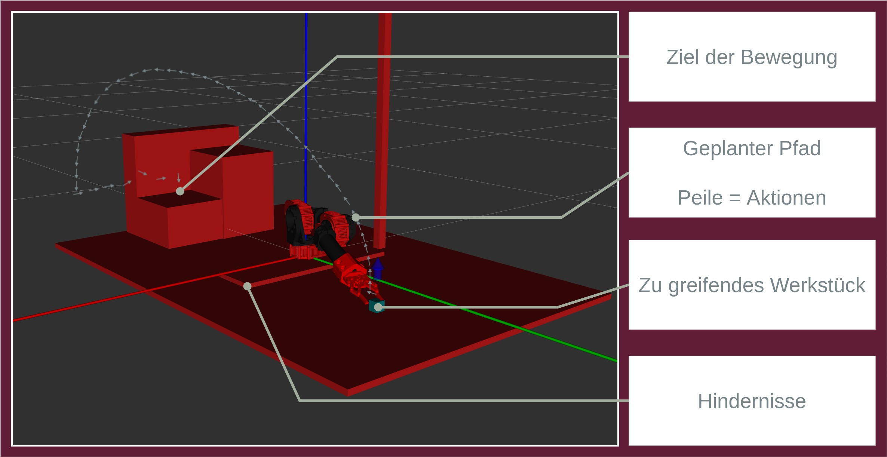

# Bis zum High-Score! Wie ein Roboter durch Ausprobieren lernt

Hier finden Sie Programmcode und Beispiele wie man Pfadplanung mittels Reinforcement Learning umsetzt. 

Dabei wurde eine Pick and Place Aufgabe mittels Reinforcement Learning und klassischer Bildverarbeitung für einen Dreiachsroboter implementiert. Der auf der [Hebi X-Series Platform](https://www.hebirobotics.com/x-series-smart-actuators) basierende Roboter soll dabei ein Werkstück auf einem Tisch erkennen, es aufheben und in eine Fräse legen. Dabei wird wie folgt vorgegangen:

- Der Roboter erfasst den Tisch mithilfe einer Kamera. Auf das Kamerabild wird klassische Bildberarbeitung angewendet, um die Position des Werkstücks im Kamerabild zu ermitteln. Da die Kamera vorab am Tisch eingemessen wurde, kann die Position des Werkstücks im Kamerabild in die globale Position auf dem Tisch umgewandelt werden.

- Der Roboter plant anschließend sowohl einen Pfad von seiner derzeitigen Pose zum Werkstück als auch vom Werkstück zur Ablegepose mittels [Reinforcement Learning](https://www.youtube.com/watch?v=gNjDBkJRRP0&list=PLfJEPw9Zb0EPLEZZlNCQc9F3F7RWG6EsK&index=13).

# Der Use Case

Die Implementierung basiert auf Python 3 und dem [Robot Operating System (ROS)](https://www.ros.org/). ROS ist eine Entwicklungsumgebung für Robotik Anwendungen und ermöglicht es uns für den Use Case einen Roboter zu simulieren. Damit ROS zur Ausführung des Codes installiert sein muss, stellen wir einen Docker Container, welcher alle benötigten Software Pakete beinhaltet, zur Verfügung.

[Docker](https://www.docker.com/) erlaubt es uns, abgekapselte Umgebungen, sogenannte Container, für verschiedene Programme aufzusetzen. Dabei können für eine Anwendung erforderliche Komponenten automatisch in einem Container installiert und deinstalliert werden. Wir verwenden Docker, um den Beispielcode einfach ausführbar zu machen, ohne dass die verwendeten Software Pakete direkt auf Ihrem PC installiert werden müssen.

Das Skript _setupEnvironment.sh_ lädt automatisch alle benötigten Komponenten herunter und erstellt eine Ordnerstruktur, in der benötigte Dateien gespeichert werden

Das Skript _buildandrun.sh_ im neu erstellten Ordner _ros-ml-container_ erzeugt automatisch den Docker Containter mit der benötigten Robotiksoftware. Der Container beinhaltet ROS und Python 3, sowie [OpenAI Gym](https://gym.openai.com/), einem Framework zur Implementierung von Reinforcement Learning Umgebungen. Damit das Skript funktioniert, müssen folgende Systemvoraussetzungen erfüllt sein:

- Unter Linux muss Docker Berechtigungen haben, ohne _sudo_ ausgeführt zu werden. Diese Berechtigung gibt man, indem man _sudo groupadd docker && sudo usermod -aG docker $USER_ im Terminal eingibt und sich anschließend aus- und einloggt.

- Unter Linux muss X11 forwarding erlaubt sein.

- Eine Internetverbindung zum Download der benötigten Komponenten.

Beschleunigung durch eine Grafikkarte wird unterstützt, damit die Simulation flüssig und in Echtzeit angezeigt werden kann. Bei der Ausführung des Skriptes (_./buildandrun.sh_) kann die Umgebungsvariable *GRAPHICS_PLATFORM* übergeben werden, um Grafikbeschleunigung zu verwenden. Folgende Parameter werden unterstützt:

- *GRAPHICS_PLATFORM=cpu ./buildandrun.sh*: keine GPU beschleunigung. Gleiches Verhalten, wie wenn kein Wert für *GRAPHICS_PLATFORM* gesetzt wird.

- *GRAPHICS_PLATFORM=opensource ./buildandrun.sh*: Beschleunigung durch Open Source Treiber in Linux. Funktioniert für GPUs von Intel, Nvidia und AMD, sofern die offenen Treiber verwendet werden. Wenn Sie sich nicht sicher sind, welcher Treiber auf Ihrem PC installiert ist, funktioniert wahrscheinlich diese Art der Beschleunigung.

- *GRAPHICS_PLATFORM=nvidia ./buildandrun.sh*: Beschleunigung durch den Proprietären Nvidia Treiber in Linux. Dazu muss der proprietäre Nvidia Treiber am System installiert sein.

- *GRAPHICS_PLATFORM=amdpro ./buildandrun.sh*: Beschleunigung durch den Proprietären AMD Treiber in Linux. Dazu muss zumindest die OpenCL Komponente des proprietären AMDGPU Pro Treibers am System installiert sein.

Docker erzeugt ein Image, welches die vom Use Case benötigten Komponenten beinhaltet. Dieses Image kann mit dem *docker rmi -f ros-ml-container:latest* Befehl gelöscht werden.

# Ergebnisse

Da die Winkelstellungen der Motoren bei dieser Lösung als diskret betrachtet werden, ist die Genauigkeit der Pfadplanung abhängig vom Grad mit dem die Winkelstellungen diskretisiert werden. Bei dieser Implementierung wurde die Diskretisierung auf 0,1 rad gestellt, um den benötigten Rechenaufwand der Pfadplanung gering zu lassen. Reicht eine solche Genauigkeit nicht aus, kann die Diskretisierung auf einen niedrigeren Wert gesetzt werden, was jedoch die benötigte Zeit zum berechnen des Pfades erheblich erhöht.

Abbildung 1 zeigt einen solchen Pfad, welcher mittels Reinforcment Learning ermittelt wurde. Dabei stellen die Pfeile den geplanten Pfad zum Ziel dar.

Da klassische Bildverarbeitung eingesetzt wird ist die Erkennung des Werkstücks sehr stark von den Lichtverhältnissen der Umgebung abhängig. Hier könnte der Einsatz moderner Methoden zur Objekterkennung, wie z.B. ein Convolutional Neural Network (CNN, siehe AIAV Video [CNN Detector](https://www.youtube.com/watch?v=xIXGDepixcg&list=PLfJEPw9Zb0EPLEZZlNCQc9F3F7RWG6EsK&index=5) die Fehleranfälligkeit der Lösung verbessern.

# Diskussion

Mittels diesem Usecase haben wir gezeigt, dass auch einfache Reinforcement Learning Methoden praktische Anwendungen in der Robotik haben. Anstatt die Kinematik des Roboters zu rechnen, lassen wir sie durch Policy Iteration lösen. Der Roboter findet so den kürzesten Pfad zwischen Start- und Zielpose und verhindert Kollisionen mit sich selbst und der Umgebung.

