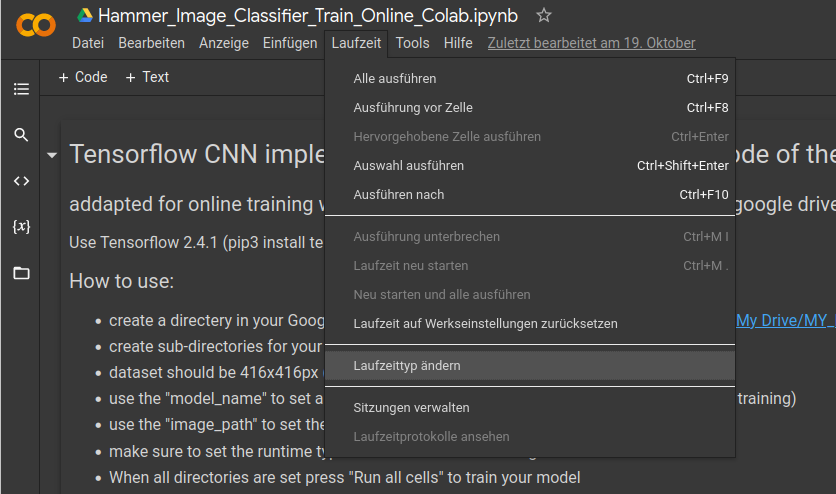
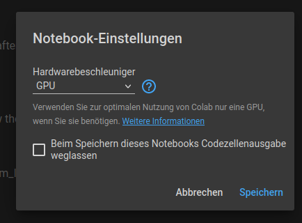

# Convolutional Neural Network für Bildklassifizierung

In diesem Use-Case werden wird ein CNN Implementiert. Die Theorie dazu wird ausführlich im [hier](https://www.aiav.technikum-wien.at/ai-anwenden) im Storyboard ausführlich beschrieben. Hier befindet sich nun der entsprechende Code dazu.  

## Bibliotheken

Alle benötigten Bibliotheken sind in der [requirements-Datei](./requirements.txt) aufgelistet und können auch über diese installiert werden. Wie das genau funktioniert ist in diesem [Tutorial](https://note.nkmk.me/en/python-pip-install-requirements/) auch beschrieben.  

Die Implementierung des [CNN Models](https://www.tensorflow.org/tutorials/images/classification) ist mittels [Tensorflow](https://www.tensorflow.org/) in der Programmiersprache [Python](https://docs.python.org/3/) umgesetzt. Für die Einbindung der Kamera und Bildverarbeitung wird [OpenCV](https://opencv.org/) verwendet. 

Aufgrund von unterschiedlichen Strukturen von Tensorflow ist es wichtig, dass Tensorflow 2.4.1 installiert ist. Dies kann entweder mittels der requirements.txt Datei gemacht werden oder manuel mit  > _
pip3 install tensorflow==2.4.1_ <

## Ordnerstruktur

1. Tool_Data
2. model_x_xxxExxB
3. Hammer_Image_Classifier_Train_Online_Colab.ipynb
4. Webcam_Hammer_Classifier.ipynb
5. requirements.txt
6. ReadMe.md

## Workflow Online 
- Erstellen Sie einen Ordner in Ihrem Google Drive für Ihre Bilder für die Schulung. (z. B.: "/Inhalt/Laufwerk/Mein Laufwerk/Mein_Folder/Colab_Notebooks/" )
- Erstellen Sie Unterverzeichnisse für Ihre verschiedenen Klassen

- der Datensatz sollte Bilder beinhalten die 416x416px groß sind (kann allerdings im Sourcecode mit den Variablen _img_width_ und _img_height_ angepasst werden)

- Verwenden Sie im Notebook die Variable _model_name_, um einen Namen zu vergeben (damit wird nach dem Training ein Ordner mit dem gespeicherten Modell erstellt)
- verwenden Sie _image_path_, um den Pfad zu Ihrem benutzerdefinierten Datensatz festzulegen

- Stellen Sie sicher, dass der Laufzeittyp auf "GPU" eingestellt ist, um schneller trainieren zu können. Wie das eingestellt werden kann ist hier weiter unten beschrieben. 

- Wenn alle Verzeichnisse eingestellt sind, klicken Sie auf "Run all cells", um Ihr Modell zu trainieren

- in der zweiten Zelle werden Sie aufgefordert, Ihr Google Drive-Konto zu authentifizieren. Folgen Sie einfach dem angegebenen Link und akzeptieren Sie die Anforderungen. Kopieren Sie den Authentifizierungscode und fügen Sie ihn in die zweite Zelle ein. 

- Das Modell wird nun mit Ihrem Datensatz und einer GPU über die Google Colab Server trainiert.

- das Modell wird in Ihrem Google Drive gespeichert. Dieses kann dann mit dem "Webcam_Image_Classifier.ipynb" Notebook verwendet werden

## Workflow Offline
- Laden Sie den Ordner mit den Modellgewichten von Ihrem Google Drive herunter und stellen Sie sicher, dass sich der Ordner mit den Modellgewichten im richtigen Verzeichnis für den "model_name" befindet.

- "model_name" muss mit dem Ordner "weights" übereinstimmen

- Führen Sie alle Zellen aus. 

- Wenn das Gerät (Webcam) nicht geöffnet werden kann, versuchen Sie, die devide_number im Sourcecode entweder auf -1, 0 oder 1 zu ändern. (Dies hängt davon ab, ob Ihr System eine interne Kamera hat oder nicht)
    - devide_number = -1 ->  keine Spezielle Angabe zum Port
    - devide_number = 0 wenn nur eine Webcam angeschlossen ist 
    - devide_number = 1 wenn eine eingebaute Webcam am Rechner vorhanden ist aber eine USB-Webcam verwendet werden soll
    

## Google Colab

Wie schon angesprochen ist in diesem Use-Case das trainieren eines CNNs notwendig. Damit nicht die notwendige Hardware für diesen Rechenintensiven vorgang angeschafft werden muss, wird Google Collaboratory herangezogen. Google Collaboratory oder auch kurz Colab ist ein von Google zur verfügung gestellte Platform auf der Python-Notebooks ausgeführt werden können. Ebenso kann GPU-Rechenleistung dazugeschalten werden. 

### Einstellen der GPU-Laufzeit 
1) Im Reiter **Laufzeit** auf **Laufzeittyp ändern** klicken. 
  
     
2) Nachdem sich das unten abgebildete Fenster geöffnet hat kann mittels der Pfeiltaste des Auswahlfensters **Hardwarebeschleuniger** von None oder TPU auf **GPU** gewechselt werden.   
 

## Ergebnisse

## Weitere externe Informationen/ Quellen

Usefull links:  
[CNN Model](https://www.tensorflow.org/tutorials/images/classification)  
[Konvertieren OpenCV Mat zu Tensorflow](https://stackoverflow.com/questions/40273109/convert-python-opencv-mat-image-to-tensorflow-image-data/40273815) 
[Google Colab](https://colab.research.google.com/notebooks/welcome.ipynb?hl=de)