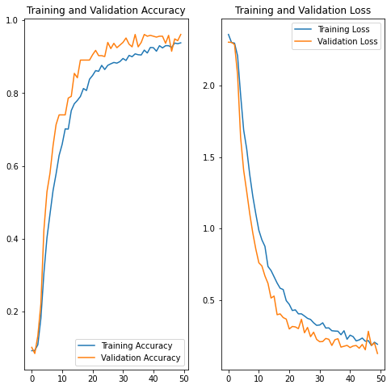

# Convolutional Neural Network für Bildklassifizierung

Das vorliegende GitHub Repository befasst sich mit der implementierung des des CNN Use-Cases zu klassifizierung von Zeichensprache. Theorie und das Storyboard ist [hier](https://www.aiav.technikum-wien.at/ai-anwenden) zu finden.  

 
 
 

## Bibliotheken
Um das Notebook ausführen zu können werden gewisse Bibliotheken benötigt. Diese sind in der [requirements-Datei](./requirements.txt) aufgelistet und können auch über diese installiert werden. Wie das genau funktioniert ist in diesem [Tutorial](https://note.nkmk.me/en/python-pip-install-requirements/) auch beschrieben.  

Die Implementierung des [CNN Models](https://www.tensorflow.org/tutorials/images/classification) ist mittels [Tensorflow2](https://www.tensorflow.org/) in der Programmiersprache [Python](https://docs.python.org/3/) umgesetzt. Für die Einbindung der Kamera und Bildverarbeitung wird [OpenCV](https://opencv.org/) verwendet. 

Aufgrund von unterschiedlichen Strukturen von Tensorflow ist es wichtig, dass Tensorflow 2.8.0 installiert ist. Dies kann entweder mittels der requirements.txt Datei gemacht werden oder manuel mit  **>> _pip3 install tensorflow==2.8.0_ <<**

## Ordnerstruktur

Das CNN Model benötigt - wie auch die anderen Modelle - zum Trainieren einen Datensatz. Wir verwenden dazu einfach Ordner mit verschiedenen Bildern. Im Ordner [data](./data) sind die ganzen Trainingsdaten abgelegt. Da wir "nur" eine Klassifizierung machen, können wir die Bilder Labeln indem wir den Ordnernamen so benennen wie auch unsere Klasse heißen soll. So kann der Code auch einfach angepasst werden, sollten eigene Bilder verwendet werden. Da wir versuchen die Zahlen '0' bis '9' zu klassifizieren, heißen so auch die Unterordner. 

Der Ordner demo beinhaltet von jeder Zahl ein Test bild, welches wir nach dem Trainieren des Modells schnell einsetzen können um zu sehen ob unser Modell funktioniert.

Die Bilder haben wir nicht selber aufgenommen. Wir verwenden hier einen Datensatz, welcher von der Turkey Ankara Ayrancı Anadolu High School zur verfügung gestellt wurde. Dieser kann [hier](https://github.com/ardamavi/Sign-Language-Digits-Dataset) heruntergeladen werden. 

## Ergebnisse

In dem Notebook [CNN_added_LRP.ipynb](./CNN_added_LRP.ipynb) ist die Implementierung zu finden. Der genaue Ablauf ist in dem Notebook beschrieben. Anbei ist ein GIF, welches das Ergebnis der Webcam Implementierung zeigt. 

 

Nach 50 Trainingsepochen wurde eine Genauigkeit von 93.82% erreicht.Dies ist auch in der unteren Abbildung zu sehen. Genauere Informationen zu der größe des Datensatzes und der interpretation der Grafik sind im Storyboard zu finden. 

## Was nun? 

Wie auch schon im Storyboard angesprochen haben wir uns bisher nur mit Klassifizierungen beschäftigt. Sprich wir wissen nun ob auf einem Bild eine gewisse Zahl zu sehen ist oder nicht. Wenn wir nun aber mehr Informationen benötigen, wie zum Beispiel "wo befindet sich mein Objekt auf dem Bild", dann benötigen wir komplexere Modelle. Hierzu können wir den CNN-Detector Use-Case empfehlen ([Coming soon](https://www.aiav.technikum-wien.at/)). Dieser Use-Case beschäftigt sich damit auf Bildern Objekte zu finden und diese zu Markieren. 

Falls dieses zu komplex oder zu Hardware intensiv ist, können wir die etwas rechenfreundlicheren Klassifizierungen empfehlen welche wir in den unten aufgelisteten Use-Cases behandelt haben. Vielleicht passen diese besser für Ihren Anwendungsfall? 

#### logistische Regression  
[Storyboard](http://www.aiav.technikum-wien.at/)  
[GitHub](https://github.com/TW-Robotics/AIAV/tree/devel_abdank/Logistische_Regression_fuer_Bildklassifizierung)  
### Support Vector Machine  
[Storyboard](http://www.aiav.technikum-wien.at/)  
[GitHub](https://github.com/TW-Robotics/AIAV/tree/devel_abdank/Support_Vector_Machine_fuer_Bildklassifizierung)  
#### k-Neares Neighbour  
[Storyboard](http://www.aiav.technikum-wien.at/)  
[GitHub](https://github.com/TW-Robotics/AIAV/tree/devel_abdank/kNearest_Neighbor_fuer_Bildklassifizierung)  
#### Random Forest  
[Storyboard](http://www.aiav.technikum-wien.at/)  
[GitHub](https://github.com/TW-Robotics/AIAV/tree/devel_abdank/Random_Forest_fuer_Bildklassifizierung)

## Weitere externe Informationen/ Quellen

[CNN Model](https://www.tensorflow.org/tutorials/images/classification)  
[Konvertieren OpenCV Mat zu Tensorflow](https://stackoverflow.com/questions/40273109/convert-python-opencv-mat-image-to-tensorflow-image-data/40273815) 