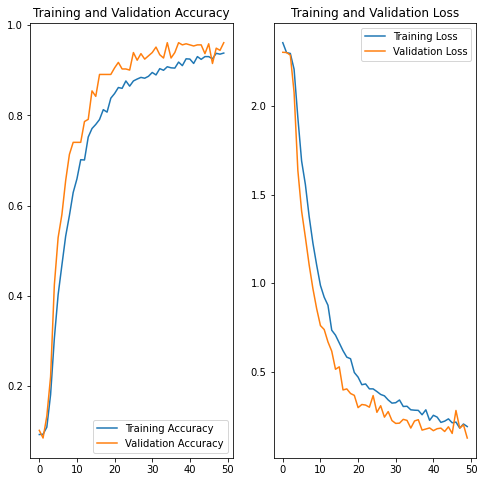

# Convolutional Neural Networks: Erkennen räumlicher Zusammenhänge

Das vorliegende GitHub Repository befasst sich mit der implementierung des des CNN Use-Cases zu klassifizierung von Zeichensprache. Theorie und das Storyboard ist [hier](https://www.aiav.technikum-wien.at/ai-anwenden) zu finden.  

 
 
 

__Durch Probleme in der Onlineansicht kann es vorkommen, dass die Bilder im Notebook hier auf Github nicht angezeigt werden. Sollte dies der Fall sein, können Sie sich den [AIAV Ordner](https://github.com/TW-Robotics/AIAV/archive/refs/heads/main.zip) herunterladen und [Notebook.html](Notebook.html) lokal im Browser anzeigen lassen.__

# Der Use Case

Die Implementierung basiert auf [Python 3](https://docs.python.org/3/) und verwendet folgende Module:

- [NumPy](https://numpy.org/)
- [OpenCV](https://opencv.org/)
- [Pillow](https://pillow.readthedocs.io/en/stable/)
- [Tensorflow](https://www.tensorflow.org/)
- [tf-explain](https://tf-explain.readthedocs.io/en/latest/)

Diese benötigten Module sind in der [requirements-Datei](./requirements.txt) aufgelistet und können auch mittels dieser installiert werden. Wie das genau funktioniert ist in diesem [Tutorial](https://note.nkmk.me/en/python-pip-install-requirements/) beschrieben.  

Die Implementierung des [CNN Models](https://www.tensorflow.org/tutorials/images/classification) ist mittels [Tensorflow2](https://www.tensorflow.org/) in der Programmiersprache [Python](https://docs.python.org/3/) umgesetzt. Für die Einbindung der Kamera und Bildverarbeitung wird [OpenCV](https://opencv.org/) verwendet. 

Aufgrund von unterschiedlichen Versionen von Tensorflow ist es wichtig, dass Tensorflow 2.8.0 installiert ist. Dies kann entweder mittels der requirements.txt Datei gemacht werden oder manuell mittels des Befehls ```pip3 install tensorflow==2.8.0```

Als Trainingsdatensatz verwenden wir Bilder, welche von der Turkey Ankara Ayrancı Anadolu High School zur verfügung gestellt wurden [Quelle](https://github.com/ardamavi/Sign-Language-Digits-Dataset). Die Trainingsdaten können heruntergeladen werden, indem Sie unser [Download-Skript](./downloadDataset.sh) mit dem Befehl ```bash downloadDataset.sh``` in diesem Verzeichnis ausführen. Die Trainingsdaten werden anschließend in dem Unterordner **./data** abgelegt. Bitte beachten Sie, dass Sie zum Ausführen des Skripts den ```git``` Befehl installiert haben müssen.

## Ordnerstruktur

Das CNN Model benötigt, wie auch die anderen auf unserer Platform vorgestellten Modelle, einen Datensatz für das Training. Wir verwenden dazu Ordner mit verschiedenen Bildern. Im Ordner [data](./data) sind die verwendeten Trainingsdaten abgelegt. Da wir "nur" eine Klassifizierung machen, können wir die Bilder beschriften, indem wir den Ordnernamen so benennen wie auch unsere Klasse heißen soll. So kann der Code auch einfach angepasst werden, falls eigene Bilder verwendet werden sollen. Da wir versuchen die Zahlen '0' bis '9' zu klassifizieren, heißen so auch die Unterordner. 

Der Ordner [demo](./demo) beinhaltet von jeder Zahl ein Testbild, welches wir nach dem Trainieren des Modells schnell einsetzen können um zu sehen, ob unser Modell funktioniert.

# Ergebnisse

In dem Notebook [CNN_added_LRP.ipynb](./CNN_added_LRP.ipynb) ist die Implementierung zu finden. Der genaue Ablauf ist in dem Notebook beschrieben. Anbei ist ein GIF, welches das Ergebnis der Webcam Implementierung zeigt. 

 

Nach 50 Trainingsepochen wurde eine Genauigkeit von 93.82% erreicht. Dies ist auch in der unteren Abbildung zu sehen. Genauere Informationen zu der größe des Datensatzes und der interpretation der Grafik sind im Storyboard zu finden. 




# Diskussion 

Wie auch schon im Storyboard angesprochen haben wir uns bisher nur mit Klassifizierung beschäftigt. Dabei ermitteln wir lediglich, ob auf einem Bild eine gewisse Zahl zu sehen ist oder nicht. Wenn wir nun aber mehr Informationen benötigen, wie zum Beispiel "wo befindet sich mein Objekt auf dem Bild", dann benötigen wir komplexere Modelle/Verfahren. Ein nächster Schritt für den Use Case wäre also, ihn auf einen Detektor zu erweitern (siehe AIAV Video [CNN Detector](https://youtu.be/xIXGDepixcg)). 

Falls diese Implementierung zu komplex oder zu Hardware-intensiv ist, können wir die etwas rechenfreundlicheren Klassifizierungen empfehlen welche wir in den unten aufgelisteten Use-Cases behandelt haben. Vielleicht passen diese besser für Ihren Anwendungsfall? 


- **Logistische Regression:**
    [AIAV Link](https://www.aiav.technikum-wien.at/post/logistic-regression-der-einfachste-weg-kleidungsst%C3%BCcke-zu-klassifizieren)

    Im Zuge dieses Use Cases verwenden wir Hauptkomponentenanalyse und logistische Regression zum Klassifizieren von Kleidungsstücken.

    

- **K-Nearest Neighbor:**
    [AIAV Link](https://www.aiav.technikum-wien.at/post/von-nachbarn-und-deren-merkmalen-zur-klassifizierung-von-buchstaben)

    Im Zuge dieses Use Cases verwenden wir Hauptkomponentenanalyse und k-Nearest Neighbor Klassifizierung von Ziffern.


# Weitere externe Informationen/ Quellen

- [Verwendetes CNN Model](https://www.tensorflow.org/tutorials/images/classification) </br>
- [Konvertierung vom OpenCV Mat Format zu Tensorflow](https://stackoverflow.com/questions/40273109/convert-python-opencv-mat-image-to-tensorflow-image-data/40273815)</br>