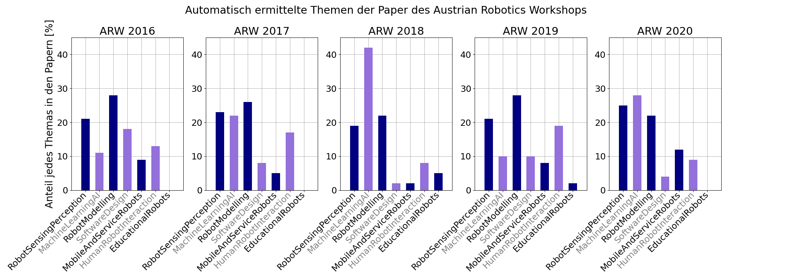

# Erkläre eine Robotik Konferenz... mit AI!

Hier finden Sie Programmcode und Beispiele, wie man große Mengen an Text automatisiert erfassen und auswerten kann, um sich einen Überblick über die bearbeiteten Themen zu verschaffen.

Wir haben hier neben anderen Textverarbeitungsmethoden [Regular Expressions (RegEx)](https://docs.python.org/3/howto/regex.html) verwendet, um Schlüsselwörter für die Veröffentlichungen des [Austrian Robotics Workshops (ARW)](https://roboticsworkshop.at/) zu generieren. Die Schlüsselwörter dienen als Grundlage für eine einfache Klassifizierung, welche ermittelt, welcher der Themenbereiche des ARW bearbeitet wurde.

Die Grundlagen von Regular Expressions, sowie das genaue Vorgehen sind Schritt für Schritt im [Notebook](./Notebook.ipynb) präsentiert. Wenn Sie den Beispielcode selbst testen wollen, finden Sie hier ein Skript (*buildandrun.sh*), welches die erforderlichen Komponenten installiert, die ARW Publikationen herunterlädt und die Applikation ausführt.

# Der Use Case

Die Implementierung benötigt neben [Python 3](https://docs.python.org/3/) und dessen eingebautem [re Modul](https://docs.python.org/3/library/re.html),[tika-python](https://github.com/chrismattmann/tika-python) zum Einlesen der PDF Dateien, sowie [NumPy](https://numpy.org/) und das [Natural Language Toolkit](https://www.nltk.org/). Da Tika Java Komponenten benötigt, wird ein Dockerfile zur Verfügung gestellt, welches die benötigten Software Pakete automatisch in einer abgekapselten Umgebung, dem Container, installiert. Bei Ausführung des *buildandrun.sh* Skriptes wird dieser Container erstellt, die Publikationen automatisch in den [app](./app) Ordner heruntergeladen und das Programm ausgeführt.

Damit das Skript funktioniert, müssen folgende Systemvoraussetzungen erfüllt sein:

- Docker muss installiert sein. Unter Linux kann Docker [nativ Installiert werden](https://docs.docker.com/engine/install/ubuntu/), unter Windows wird [das wsl2 Backend benötigt](https://docs.docker.com/desktop/windows/install/) (für Windows wird Windows 10 Update 21h1 oder höher benötigt, da sonst die Fenster von Docker nicht angezeigt werden können).

- Unter Linux muss Docker Berechtigungen haben, ohne _sudo_ ausgeführt zu werden. Diese Berechtigung gibt man, indem man _sudo groupadd docker && sudo usermod -aG docker $USER_ im Terminal eingibt und sich anschließend aus- und einloggt.

- Unter Linux muss X11 forwarding erlaubt sein.

- Eine Internetverbindung zum Download der benötigten Komponenten.

# Ergebnisse

Abbildung 1 zeigt die Ergebnisse der Klassifikation der Paper pro Jahr für die Workshops von 2016 bis 2020. Die Themenbereiche der Veröffentlichungen zeigen einen klaren Trend zur Verwendung von Künstlicher Intelligenz in Robotik. Besonders im Jahr 2018, dem einzigen Jahr zwischen 2016 und 2020, in dem der Austrian Robotics Workshop nicht zusammen mit einer anderen Konferenz abgehalten wurde, fällt der Anteil an Publikationen mit Fokus auf AI sehr hoch aus. Dies zeigt uns, dass AI in der österreichischen Forschung an Robotik Anwendung findet.

# Diskussion

In diesem Use Case haben wir uns mit der Verarbeitung von geschriebenem Text befasst. Dabei zeigen wir, dass Werkzeuge wie Regular Expressions, es uns erlauben schnell und effizient Text automatisiert zu verstehen. Dadurch das RegEx so optimiert sind, können Untersuchungen von großen Mengen Text lokal, ohne viel Rechenleistung durchgeführt werden.