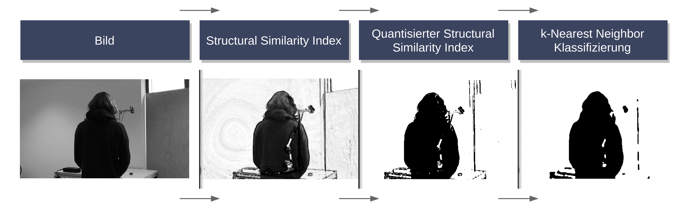

# K-Nearest Neighbour für Bildsegmentierung

Hier finden sie Programmcode und Beispiele, wie man Klassifizierungsaufgaben mittels dem [k-Nearest Neighbour (kNN)](https://cs.nyu.edu/~roweis/papers/ncanips.pdf) Verfahren durchführen kann.

Im Zuge diese Use Cases verwenden wir kNN, um in einem Bild die Grenzen zwischen Vorder- und Hintergrund zu ermitteln. Dabei vergleichen wir ein vorab aufgenommenes Bild vom Hintergrund mit neuen Bildern. Basierend auf dem Vergleich klassifizieren wir jeden Bildpunkt mittels kNN, um Vorder- und Hintergrund klar zu trennen.

Die Grundlagen von kNN sowie das genaue Vorgehen sind Schritt für Schritt im [Notebook](./Notebook.ipynb) gezeigt. Wenn Sie den Beispielcode selbst testen wollen, finden Sie hier ein Skript (*buildandrun.sh*), welches die erforderlichen Komponenten in einem Python 3 Virtual Environment installiert und die Applikation mithilfe von inkludierten [Beispielbildern](./testImages) ausführt.

__Durch Probleme in der Onlineansicht kann es vorkommen, dass die Bilder im Notebook hier auf Github nicht angezeigt werden. Sollte dies der Fall sein, können Sie sich den [AIAV Ordner](https://github.com/TW-Robotics/AIAV/archive/refs/heads/main.zip) herunterladen und [Notebook.html](Notebook.html) lokal im Browser anzeigen lassen.__

# Der Use Case

Die Implementierung basiert auf [Python 3](https://docs.python.org/3/) und verwendet [OpenCV](https://opencv.org/), [Pillow](https://pillow.readthedocs.io/en/stable/) und [Skimage](https://scikit-image.org/) zum Einlesen und Vorverarbeitung der Bilder. Die kNN Klassifizierung wird mittels [NumPy](https://numpy.org/) und der [Scikit Learn Bibliothek](https://scikit-learn.org/stable/) durchgeführt.

Das *buildandrun.sh* (*buildandrun.ps1* unter Windows) Skript erstellt ein Python Virtual Environment, installiert die benötigten Pakete in diesem und führt den Beispielcode aus. Folgende Systemvoraussetzungen müssen erfüllt sein, damit der Beispielcode ausgeführt werden kann:

- Python 3, Pip und Python Virtual Environments müssen installiert sein. Unter Windows werden diese drei Komponenten durch den [Python 3 Installer](https://www.python.org/downloads/windows/) installiert. Unter Linux werden sie durch den  Befehl *sudo apt install python3 python3-pip python3-venv* installiert.

- Eine Internetverbindung zum Download der benötigten Komponenten.

# Ergebnisse

Abbildung 1 zeigt die Verarbeitung eines Bespielbildes, auf dem ein Mitarbeiter vom Technikum Wien vor einem Roboter steht. Dabei wollen wir den Teil des Bildes auf dem der Mitarbeiter zu sehen ist ermitteln. Da der Vergleich zwischen neuem und Referenzbild in Graustufen durchgeführt wird, funktioniert die Hintergrundentfernung besonders gut, wenn ein hoher Kontrast zwischen Vorder- und Hintergrund vorhanden ist. Dieses Verhalten schreibt uns auch die Grenzen der Applikation vor. Haben Vorder- und Hintergrund an einer Stelle eine ähnliche Farbe, wird dieser Teil des Bildes eher als Hintergrund eingestuft.

# Diskussion

In diesem Use Case haben wir uns mit dem Finden von Grenzen mithilfe von k-Nearest Neighbour (kNN) Klassifikatoren beschäftigt. Dabei wurde gezeigt, wie kNNs eingesetzt werden und wie verschiedene Werte für k den Ausgang der Klassifizierung beeinflussen können. kNNs ermöglichen durch ihre gute Performance und niedrigen Implementierungsaufwand effiziente Lösungen für Klassifizierungsprobleme.

