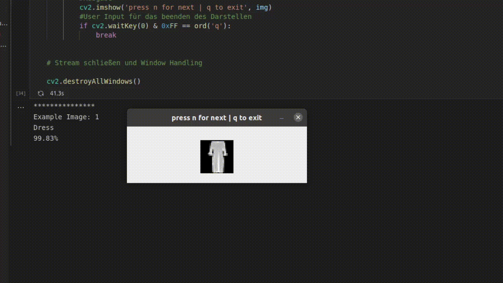

# Logistische Regression

Hier befindet sich der [Beispielcode](./miniUsecase11_logistic_regression.ipynb) für das Implementieren einer logistischen Regression. Wie schon im Storyboard besprochen wollen wir mit diesem Modell Bilder von Kleidungsstücken klassifizieren. 

# Bibliotheken
Die Implementierung ist mittels der [scikit-learn](https://scikit-learn.org/stable/modules/generated/sklearn.linear_model.LogisticRegression.html) Bibliothek in der Programmiersprache [Python](https://docs.python.org/3/) umgesetzt. 

Alle benötigten Bibliotheken sind in der [requirements-Datei](./requirements.txt) aufgelistet und können auch über diese installiert werden. 

# Ordnerstruktur
Die logistische Regression benötigt zum Trainieren einen Datensatz an Bildern. Der Beispielcode ist so aufgebaut, dass innerhalb der vorgegebenen Ordnerstruktur einfach die Fotos getauscht werden können. So können individuelle Datensätze trainiert werden. Im Ordner [data](./data) befinden sich zwei Unterordner. Diese sind in unserem Fall [Dress](./data/Dress) und [Pullover](./data/Pullover). Dies gibt gleich die beiden Klassen für die Klassifizierung vor. Soll der Code für einen anderen Use-Case angepasst werden, so können einfach Ordnernamen und Bilder getauscht werden. 

# Ergebnisse
Das unten angeführte [GIF](./demo.gif) zeigt ein Beispielverhalten des Use-Cases. Nach dem Trainieren werden dem Modell neue Bilder von Kleidungsstücken gezeigt. Das Modell klassifiziert anschließend diese und gibt die Prediction aus. 

Die sogenannte Accuracy (Genauigkeit) sagt uns aus wie gut unser Modell klassifizieren kann. Mit dem Testdatensatz wurde eine Accuracy von 98% erreicht. Das ist für die Praxis oft nicht gut genug. Wenn dieses Modell beispielsweise bei einer Verpackungsstation eingesetzt wird, bei der 1 Millionen Produkte am Tag verpackt werden, dann ist mit 20 000 Fehlern zu rechnen. 

# Was nun?
In dem Use-Case haben wir uns mit der Klassifizierung von Bildern mittels der logistischen Regression befasst. Wenn Sie weiteres Interesse an klassifizierungs Modellen haben, empfehlen wir auch folgende Use-Cases auf der AIAV-Platform: 

### Support Vector Machine  
[Storyboard](http://www.aiav.technikum-wien.at/)  
[GitHub](https://github.com/TW-Robotics/AIAV/tree/devel_abdank/Support_Vector_Machine_fuer_Bildklassifizierung)  
#### k-Neares Neighbour  
[Storyboard](http://www.aiav.technikum-wien.at/)  
[GitHub](https://github.com/TW-Robotics/AIAV/tree/devel_abdank/kNearest_Neighbor_fuer_Bildklassifizierung)  
#### Random Forest  
[Storyboard](http://www.aiav.technikum-wien.at/)  
[GitHub](https://github.com/TW-Robotics/AIAV/tree/devel_abdank/Random_Forest_fuer_Bildklassifizierung)

Ebenso haben wir angesprochen, dass die klassische Methode nicht immer ausreichend ist in der Praxis. Um dieses Problem zu lösen kann auf ein komplexeres Modell umgestellt werden wie zum Beispiel ein CNN. 
[Coming Soon]

 

# Weitere externe Informationen/Quellen
[Installieren von Bibliotheken mittels requirement.txt](https://note.nkmk.me/en/python-pip-install-requirements/)  
[Erstellen eines Dictionary für die verarbeitung der Trainingsbilder](https://kapernikov.com/tutorial-image-classification-with-scikit-learn/) 
[Implementierung einer PCA](https://medium.com/@sebastiannorena/pca-principal-components-analysis-applied-to-images-of-faces-d2fc2c083371) 
[Visualisierung einer PCA](https://jakevdp.github.io/PythonDataScienceHandbook/05.02-introducing-scikit-learn.html)
