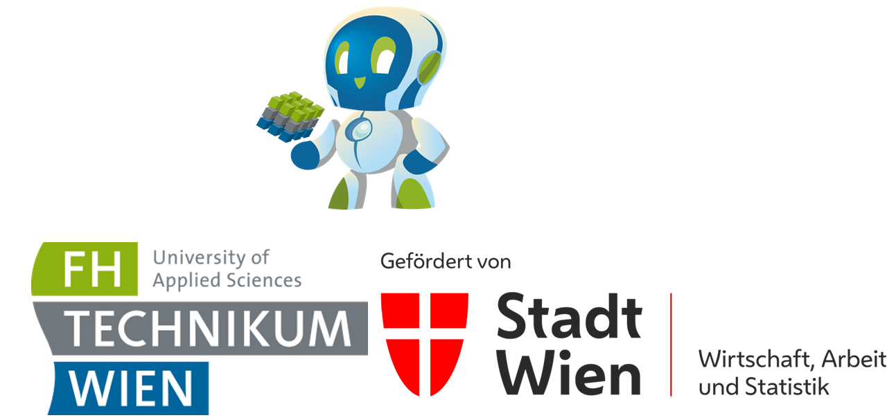

# Willkommen bei den Use Cases im MA23 Projekt AIAV

In diesen Repository finden Sie die Implementierungen der Use Cases der Plattform. In jedem hier angeführten Ordner finden Sie Erklärungen zur Software, Handhabung und Installation. 

Beachten Sie bitte: 

- Die hier angeführte Software dient ausschließlich zur Veranschaulichung der auf [AIAV](https://www.aiav.technikum-wien.at/) dargestellten Inhalte. **Sie können diese Softwre nutzen und erweitern - wir übernehmen keine Haftung und geben keine Garantie für die Funktion**. Falls Sie unsere Software nutzen wollen freuen wir uns über jede Referenz auf https://www.aiav.technikum-wien.at/.
- Die Software ist teilweise sehr an die verbaute Hardware und das Betriebssystem angepasst. Wir haben versucht etwaige Probleme und Einschränkungen bereits im Text zu beschreiben. 
- Die Jupyter Notebook sollen Ihnen die Handhabung und erziehlten Ergebnisse sowie Programmcode beschreiben. Hin und wieder klappt das in diversen Browser nicht. Sie können dieses [Repository clonen](https://docs.github.com/en/repositories/creating-and-managing-repositories/cloning-a-repository) (wenn Ihnen "clonen" nchts sagt - laden Sie einfach diese Dateien herunter).

Wir bedanken uns bei unseren Fördergeber und der FH Technikum Wien.

