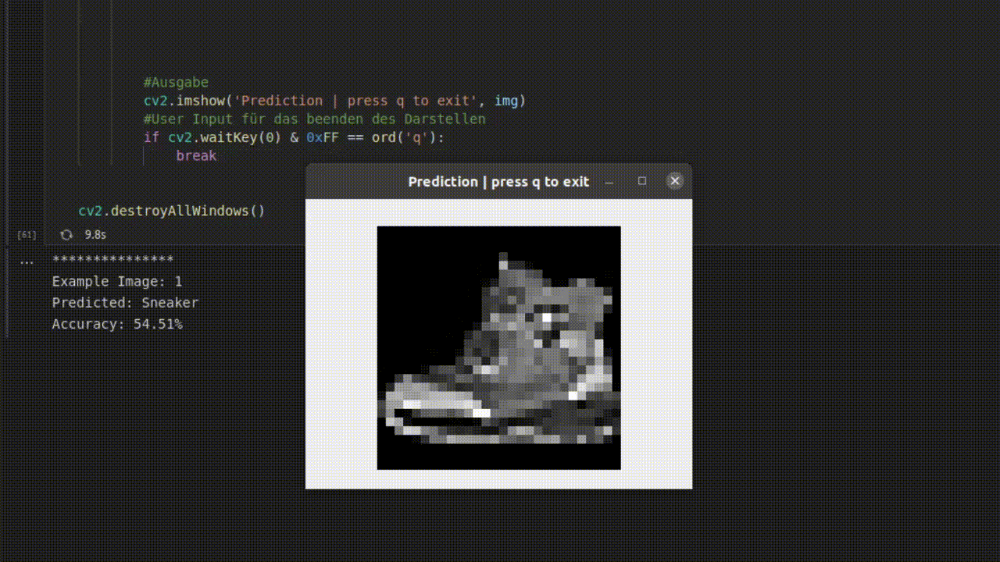

# Random Forest 

Hier befindet sich der [Beispielcode](./miniUsecase15_RandomForest.ipynb) für das Implementieren einer Support Vector Machine. Der Use Case befasst sich mit der Klassifizierung von Bildern. Genauer gesagt, wollen wir herausfinden, ob auf einem Bild eine Stiefelette oder ein Sneaker abgebildet ist. Hierzu verwenden wir den [MNIST Fashion Datensatz](https://github.com/zalandoresearch/fashion-mnist). Die Theorie zum Random Forest Model ist im [Storyboard](15_Storyboard_Random_Forest.pdf) zu finden. 

__Durch Probleme in der Onlineansicht kann es vorkommen, dass die Bilder im Notebook hier auf Github nicht angezeigt werden. Sollte dies der Fall sein, können Sie sich den [AIAV Ordner](https://github.com/TW-Robotics/AIAV/archive/refs/heads/main.zip) herunterladen und [Notebook.html](Notebook.html) lokal im Browser anzeigen lassen.__

# Bibliotheken
Die Implementierung ist mittels der [scikit-learn](https://scikit-learn.org/stable/modules/svm.html) Bibliothek in der Programmiersprache [Python](https://docs.python.org/3/) umgesetzt.

Diese drei Bibliotheken geben das Grundgerüst vor. Alle benötigten Bibliotheken sind in der [requirements-Datei](./requirements.txt) aufgelistet und können auch über diese installiert werden. Wie das genau funktioniert ist in diesem [Tutorial](https://note.nkmk.me/en/python-pip-install-requirements/) beschrieben.

# Ordnerstruktur
 Das Random Forest Model benötigt zum Trainieren einen Datensatz an Bildern. Der Beispielcode ist so aufgebaut, dass innerhalb der vorgegebenen Ordnerstruktur einfach die Fotos getauscht werden können. Im Ordner [data](./data) befinden sich zwei Unterordner. Diese sind in unserem Fall [Stiefeletten](./data/Stiefeletten) und [Sneaker](./data/Sneaker). Dies gibt gleich die beiden Klassen für die Klassifizierung vor. Soll der Code für einen anderen Use Case angepasst werden, so können einfach Ordnernamen und Bilder getauscht werden. 

# Ergebnisse
Das unten angeführte [GIF](./demo.gif) zeigt ein Beispielverhalten des Use Cases. Ein (für das Modell) neues Bild wird aus dem demo-Ordner eingelesen und das trainierte Modell versucht, das Bild richtig zu klassifizieren. Mit dem Testdatensatz wurde eine Genauigkeit (Accuracy) von ca. 90% erreicht. Wie auch schon im Use Case der [Logistische Regression](http://www.aiav.technikum-wien.at/) haben wir hier für die Praxis wahrscheinlich eine zu schlechte Genauigkeit. Wird das Modell für eine Verpackungsstation eingesetzt, bei der 1 Millionen Produkte pro Tag verpackt werden, dann sind vermutlich 100.000 verpackte Bestellungen fehlerhaft. 

# Was nun? 
In dem Use Case haben wir uns mit der Klassifizierung von Bildern mittels dem Random Forest Modell befasst. Es gibt natürlich noch weitere klassische Modelle, die ähnlich aufgebaut sind und für eine Klassifizierung eingesetzt werden können. Mit drei weiteren Modellen hat sich AIAV beschäftigt und diese sind hier verlinkt. 

#### logistische Regression  
[Storyboard](http://www.aiav.technikum-wien.at/)  
[GitHub](https://github.com/TW-Robotics/AIAV/tree/devel_abdank/Logistische_Regression_fuer_Bildklassifizierung)  
### Support Vector Machine  
[Storyboard](http://www.aiav.technikum-wien.at/)  
[GitHub](https://github.com/TW-Robotics/AIAV/tree/devel_abdank/Support_Vector_Machine_fuer_Bildklassifizierung)  
#### k-Neares Neighbour  
[Storyboard](http://www.aiav.technikum-wien.at/)  
[GitHub](https://github.com/TW-Robotics/AIAV/tree/devel_abdank/kNearest_Neighbor_fuer_Bildklassifizierung)  

Ebenso wird im Theorieteil immer von einem CNN gesprochen und dass dieses CNN vermutlich bessere Ergebnisse liefern kann, da es ein komplexeres Modell ist. Was das genau ist und wie so ein CNN Funktioniert wird ebenfalls auf der AIAV Plattform beschrieben (Link coming soon).

# Weitere externe Informationen/Quellen
[Installieren von Bibliotheken mittels requirement.txt](https://note.nkmk.me/en/python-pip-install-requirements/)  
[Erstellen eines Dictionary für die verarbeitung der Trainingsbilder](https://kapernikov.com/tutorial-image-classification-with-scikit-learn/) 
[Implementierung einer PCA](https://medium.com/@sebastiannorena/pca-principal-components-analysis-applied-to-images-of-faces-d2fc2c083371) 
[Visualisierung einer PCA](https://jakevdp.github.io/PythonDataScienceHandbook/05.02-introducing-scikit-learn.html)  
[Random Forest Dokumentation](https://scikit-learn.org/stable/modules/generated/sklearn.ensemble.RandomForestClassifier.html) 
[Implementierungs Guide zu ML Modellen](https://rpubs.com/Sharon_1684/454441) 