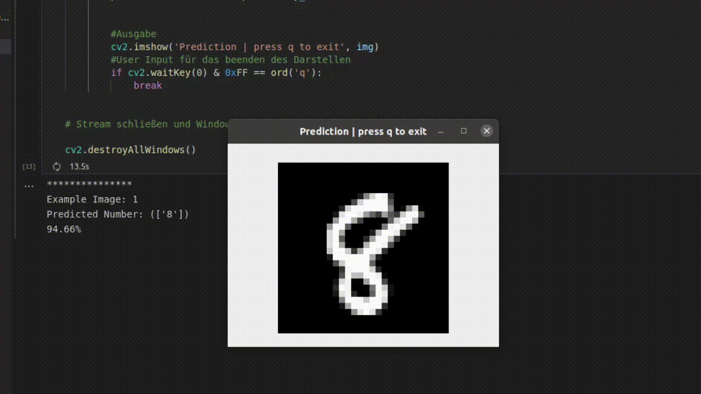

# Support Vector Machine

Hier befindet sich der [Beispielcode](./miniUsecase12_SVM.ipynb) für das Implementieren einer Support Vector Machine. Der Use Case befasst sich mit der Klassifizierung von Bildern. Genauer gesagt, wollen wir herausfinden, ob sich in einem Bild – beziehungsweise einem Kamerastream – ein Hammer befindet oder nicht. Diese Problemstellung wurde schon im vorherigen [Use Case](https://github.com/TW-Robotics/AIAV/tree/master/Logistische_Regression_fuer_Bildklassifizierung) behandelt. Allerdings befassen wir uns diesmal mit der angesprochenen SVM, anstatt einer logistischen Regression. Die Theorie und der Aufbau ist im [Storyboard](12_Storyboard_SVM.pdf) genau beschrieben.

# Bibliotheken
Die Implementierung ist mittels der [scikit-learn](https://scikit-learn.org/stable/modules/svm.html) Bibliothek in der Programmiersprache [Python](https://docs.python.org/3/) umgesetzt. 

Alle benötigten Bibliotheken sind in der [requirements-Datei](./requirements.txt) aufgelistet und können auch über diese installiert werden. Wie das genau funktioniert ist in diesem [Tutorial](https://note.nkmk.me/en/python-pip-install-requirements/) auch beschrieben.  

# Ordnerstruktur
Die SVM benötigt zum Trainieren einen Datensatz an Bildern. Der Beispielcode ist so aufgebaut, dass innerhalb der vorgegebenen Ordnerstruktur einfach die Fotos getauscht werden können. So können individuelle Datensätze Trainiert werden. Im Ordner [data](./data) befinden sich 10 Unterordner. Diese sind in unserem Fall Ordner mit der Beschriftung 0-9. In jedem Ordner sind Bilder von den entsprechenden Zahlen. Die Ordnernamen geben gleichzeitig die Klassen für die Klassifizierung vor. Soll der Code für einen anderen Use Case angepasst werden, können einfach Ordnernamen und Bilder getauscht werden. 

# Ergebnisse
Das unten angeführte [GIF](./demo.gif) zeigt ein Beispielverhalten des Use Cases. Nachdem das Modell trainiert wurde, werden dem Modell neue Bilder gezeigt. Die SVM klassifiziert diese und gibt uns die Prediction aus. 

Die SVM liefert uns eine Genauigkeit von rund 93%. Wenn wir nun das Model beispielsweise für eine Klassifizierung von Zahlen eines Drucksensors einsetzen wollen, dann müssen wir den Fehler beachten! Wenn an einem Tag (24h) alle 15 Minuten eine Messung erfolgt, dann entspricht das 96 Messungen. Darunter sind allerdings 6 Messungen wahrscheinlich falsch.  

# Was nun?
In dem Use-Case haben wir uns mit der Klassifizierung von Bildern mittels der SVM befasst. Wenn Sie weiteres Interesse an Klassifizierungsmodellen haben, empfehlen wir auch folgende Use Cases auf der AIAV-Plattform: 

#### logistische Regression  
[Storyboard](http://www.aiav.technikum-wien.at/)  
[GitHub](https://github.com/TW-Robotics/AIAV/tree/main/Logistische_Regression_fuer_Bildklassifizierung)  
#### k-Nearest Neighbour  
[Storyboard](http://www.aiav.technikum-wien.at/)  
[GitHub](https://github.com/TW-Robotics/AIAV/tree/main/kNearest_Neighbor_fuer_Bildklassifizierung)  
#### Random Forest  
[Storyboard](http://www.aiav.technikum-wien.at/)  
[GitHub](https://github.com/TW-Robotics/AIAV/tree/main/Random_Forest_fuer_Bildklassifizierung)

Ebenso haben wir angesprochen, dass in der Praxis die klassischen Methoden nicht immer ausreichend sind. Um dieses Problem zu lösen, kann auf ein komplexeres Modell, wie zum Beispiel ein Convolutional Neural Network (CNN) umgestellt werden. 
[Coming Soon]

 

# Weitere externe Informationen/Quellen
[Installieren von Bibliotheken mittels requirement.txt](https://note.nkmk.me/en/python-pip-install-requirements/)  

[Erstellen eines Dictionary für die verarbeitung der Trainingsbilder](https://kapernikov.com/tutorial-image-classification-with-scikit-learn/) 

[Implementierung einer PCA](https://medium.com/@sebastiannorena/pca-principal-components-analysis-applied-to-images-of-faces-d2fc2c083371) 

[Visualisierung einer PCA](https://jakevdp.github.io/PythonDataScienceHandbook/05.02-introducing-scikit-learn.html) 
 

[SVM Model Implementierungs Guide](https://rpubs.com/Sharon_1684/454441)
 

[SVM Dokumentation](https://scikit-learn.org/stable/modules/svm.html)
