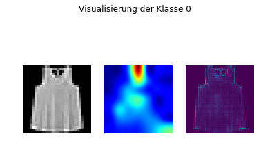
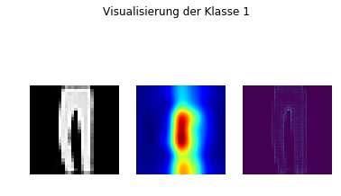
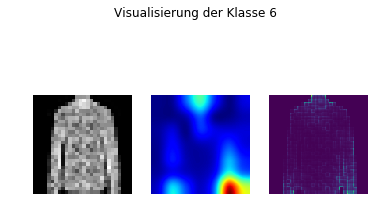

## Traue keinem CNN

Hier finden Sie Programmcode und Beispiele wie man mit einem CNN Klassifizierungsaufgaben durchführen kann und anschließend überprüft, ob das CNN erklärbare Merkmale erkannt hat.

In diesem Bereich finden Sie eine gelöste simple Aufgabe - nämlich die Klassifizierung des [fashion-mnist Datensatzes](https://github.com/zalandoresearch/fashion-mnist). Zusätzlich zum Umgang mit CNNs finden Sie hier Beispiele, um die Entscheidung von CNNs zu visualisieren. Es wird LRP und GradCAM genutzt.

Sie finden eine Schritt für Schritt Anleitung in dem Jupyter [Notebook](Notebook.ipynb). Wenn Sie selbst mit den Daten und Software arbeiten wollen finden Sie weiters ein Installationsskript. Dieses erzeugt Ihnen eine Python virtual environment.

**Achtung** Die Software wurde unter Ubuntu 18 und mit **Python 2** support getestet. Falls Sie Python 3 nutzen, müssen Sie die Software dementsprechend anpassen.

__Durch Probleme in der Onlineansicht kann es vorkommen, dass die Bilder im Notebook hier auf Github nicht angezeigt werden. Sollte dies der Fall sein, können Sie sich den [AIAV Ordner](https://github.com/TW-Robotics/AIAV/archive/refs/heads/main.zip) herunterladen und [Notebook.html](Notebook.html) lokal im Browser anzeigen lassen.__

## Der Use Case

Wir wollen, wie auf der AIAV Plattform beschrieben, herausfinden welche Bildbereiche für unser CNN für Klassifizierungsaufgaben genutzt wird. Dazu nutzen wir in diesem simplen Beispiel die Ansätze GradCAM und LRP (Layer-wise relevance propagation). Unser Vorgehen ist:

- Installation: Es wurde eine *Python virtual environment* genutzt. Durch das Ausführen der Datei *install.bash* wird die komplette nötige Software erzeugt. **Achtung:** Folgende Systemvoraussetzungen müssen erfüllt sein:
    - Ubuntu 18.04 und Python 2: Sie müssen gegebenenfalls unsere Software ansonsten anpassen
    - NVIDIA Deep Learning Libraries: Sie brauchen (wie für *deep learning* üblich) eine NVIDIA Grafikkarte mit dementsprechenden installierten Treiber
- Datensatz erzeugen: Falls Sie dieses Beispiel selbst ausführen wollen, müssen Sie den oben genannten Link anklicken und die Dateien *fashion-mnist_train.csv* sowie *fashion-mnist_test.csv* herunterladen und in einem *input* Ordner ablegen. Anschließend erzeugt die Datei *Data_Generator.py* die nötigen Daten aufgesplittet in einen Training- und einen Testordner. Der Aufruf geschieht durch *python Data_Generator.py*. 
- Das CNN trainieren: Dies geschieht im Skript *CNN.py* durch den Aufruf *python CNN.py*. Dieses Skript lädt ein Vortrainiertes CNN (VGG16 vortrainiert auf Imagenet) und passt die Struktur an den vorliegenden Datensatz an. Das bedeutet in unserem Fall die Änderung auf die richtige Anzahl an Outputneuronen (ein Neuron pro mögliche Klasse). Nachdem Sie das Skript gestartet haben, sehen Sie am Bildschirm Trainingsinformationen. Anschließend wird die Performance am Testset ausgegeben und schlussendlich wird die Entscheidung des CNNs durch GradCAM und LRP analysiert. Es werden Bilder dargestellt, welche einerseits das Rohbild und andererseits die Visualisierung von LRP und GradCAM zeigt.

## Ergebnisse 

Sie finden in diesem Repository im Ordner *results* die Ergebnisse eines Durchlaufs. Bedenken Sie: Sowohl die Erzeugung, die Initialisierung der neuen Neuronen im CNN als auch der Trainingsprozess basieren auf zufälligen Zahlen. Wenn Sie dieses Skript öfters starten werden Sie unterschiedliche Ergebnisse bekommen.

Sehen wir uns einige Ergebnisse an:

Auf der linken Seite erkennen wir das Inputbild. Daneben die GradCAM und LRP Visualisierung. Wir erkennen, dass GradCAM den Bereich zwischen den Trägern und die rechte untere Ecke als relevant empfunden hat. Der Bereich zwischen den Trägern ist verständlich für uns - der linke untere Bereich allerdings nicht (hier befinden sich keine relevanten Pixel). LRP zeigt in ähnlichen Bereichen Relevant - allerdings nicht im rechten unteren Eck des Bildes.

Dieses Ergebnis sieht in beiden Fällen nachvollziehbar aus, wobei LRP mehr Relevanz im Hosenboden zeigt und GradCAMden kompletten Bereich zwischen den Hosenbeinen.

Hier sehen wir ein nicht ganz nachvollziehbares Ergebnis. Warum ist für dieses Objekt nur das Ende des rechten Ärmels so relevant?

## Diskussion

Wir haben uns in diesem Use Case mit der Erklärbarkeit von CNN Entscheidungen beschäftigt. Wir haben gezeigt, wie GradCAM und LRP eingesetzt werden und konnten nachvollziehbare (wenn auch nicht immer komplett) Ergebnisse bekommen. Das muss nicht der Fall sein, wie [hier](https://www.nature.com/articles/s41467-019-08987-4.pdf) oder [hier](https://journals.plos.org/plosone/article/comments?id=10.1371/journal.pone.0249593) beschrieben. Seien Sie also vorsichtig bei der Verwendung von CNNs und glauben Sie nicht allen Entscheidungen.
