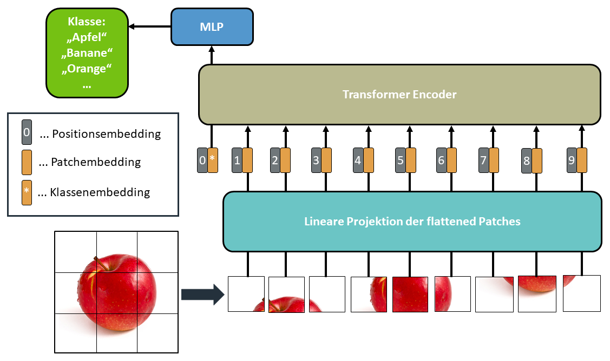
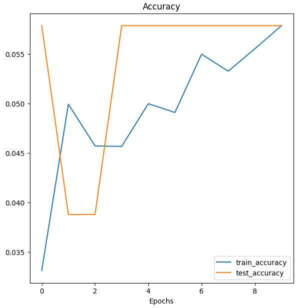
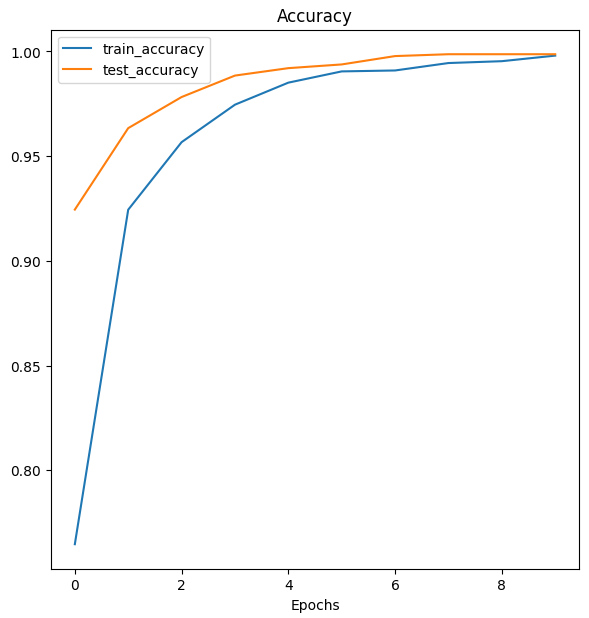

# Von_Large_Language_Models_zum_Vision_Transformer

## Der Use Case

In diesem Use Case wird die grundlegende Funktionsweise eines Vision Transformers, entsprechend Abbildung 1, erklärt, ausgecoded und auf eine Klassifikationsaufgabe, traniert und angewandt. Der Code im Jupyterlab-notebook wird analog zu dem Vision Transformer Paper [An Image is Worth 16x16 Words: Transformer for Image Recognition at Scale](https://arxiv.org/pdf/2010.11929.pdf) erstellt und auf einen neuen Datensatz getestet. Der Datensatz hierfür ist der [WOD: Web Object Dataset](https://www.acin.tuwien.ac.at/vision-for-robotics/software-tools/autonomous-robot-indoor-dataset/). Das Jupyterlab-notebook ist eine überarbeitete Form von [GitHub Repository von mrdbourke](https://github.com/mrdbourke/pytorch-deep-learning), welcher ein frei zugängliches PyTorch Tutorial auf seiner [Homepage](https://www.learnpytorch.io/) bereitstellt.


<p align="center">
  
  <br>
    <em>Abbildung 1: Übersichtgrafik Vision Transformer</em>
</p>


Für diesen Use-Case verwenden wir Python3 und Pytorch. Um dieses Projekt selber auf Ihrem lokalen Rechner ausführen zu können gehen Sie entsprechend folgender Anweisung vor:

- Installieren Sie [Docker](https://docs.docker.com/engine/install/) für Ihr System.

- Installieren Sie [Git](https://git-scm.com/book/en/v2/Getting-Started-Installing-Git) für Ihr System.

- Öffnen Sie ein Terminal bzw. Konsole (unter Windows Powershell)

- Clonen bzw. kopieren Sie den AIAV Projektordner auf ihrne lokalen Speicher mittels folgenden Befehls:

    ```console
    git clone https://github.com/TW-Robotics/AIAV/
    ```
- Navigieren Sie in den Ordner *AI_Modelle_lernen_nicht_das_was_sie_lernen_sollten*:
    ```console
    cd AIAV/AI_Modelle_lernen_nicht_das_was_sie_lernen_sollten
    ```

- Führen Sie das buildandrun Skript aus:
    - unter Windows starten Sie zuerst Docker Desktop und führen Sie dann folgenden Befehl aus:

     ```console
    .\buildandrun.ps1
    ```
    - unter Ubuntu:
     ```console
    bash buildandrun.sh
    ```
Nun wird der Docker Container heruntergeladen und startet. Der Prozess ist abgeschlossen, wenn ein Link von Jupyter-Lab in der Konsole aufscheint. Klicken Sie diesen Jupyter-Link in der Konsole an, oder kopieren Sie ihn in einen Browser Ihrer Wahl, um Jupyter-Lab zu öffnen.
Klicken Sie nun auf *notebook.ipynb* um dieses zur Ansicht und zum Ausführen in Jupyter-Lab zu öffnen. Hier können Sie nun den Code verfolgen, ausführen, und den Pfad für die Eingangsbilder adaptieren, um somit Wärmekarten von anderen Eingangsbildern zu erzeugen.

- Bevor Sie den Container erneut ausführen müssen Sie den bestehenden schließen, hierfür führen Sie bitte folgenden Befehl aus:

    ```console
    docker kill LRP
    ```

## Ergebnisse
In diesem Abschnitt werden die Ergebnisse dieses Use-Case's vorgestellt. Einerseits ist die theoretische Fundierung entsprechend Abbildung 1 ein wichtiger Bestandteil dieses Use-Cases. Weiters wurden ein von Null trainiertes Vision Transformer Modell mit den selbem (limitierten) Datensatz trainiert wie ein vortrainiertes. Die Ergebnisse hierfür sehen sie in den folgenden zwei Abbildungen 2 & 3 mit den entsprechenden Accuracy Kurven fuer Test und Trainings-Datensaetze:

<p align="center">
  
  <br>
    <em>Abbildung 2: Training und Test Accuracykurve des von Null tranierten ViT-Modells.</em>
</p>

<p align="center">
  
  <br>
    <em>Abbildung 3: Training und Test Accuracykurve des vortranierten und fine-getunten ViT-Modells.</em>
</p>


## Diskussion 

Es hat sich gezeigt, dass der Vision Transformer erst nach Anwendung einer bereits vortrainierten Version zielfuehrende Ergebnisse liefert. Dies ist sinnvoll, da Vision Transformer im Allgemeinen datenintensive Modelle sind und keine starke induktive Verzerrung in das Modell einbringen. Es ist daher nicht praktikabel, Vision Transformer von Grund auf zu trainieren, da dies einerseits einen riesigen Datensatz und andererseits enorme Rechenkapazitaeten erfordert. Wenn man jedoch ein bereits trainiertes Modell verwendet, kann man, wie wir gesehen haben, schnell gute Ergebnisse erzielen. Beim derzeitigen [Stand der Forschung](https://ieeexplore.ieee.org/stamp/stamp.jsp?tp=&arnumber=9716741) kann man sagen, dass CNN's bei kleinen Datensätzen gut abschneiden und Transformer bei großen Datensätzen besser.
