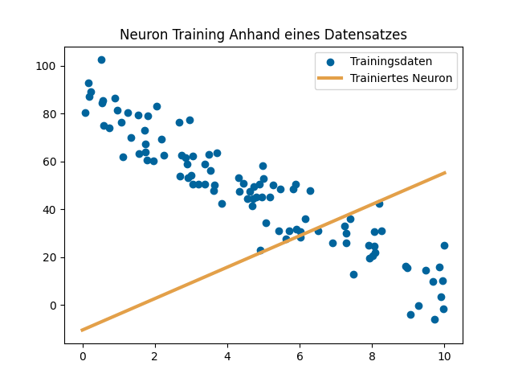

# Wanderung in Richtung des geringsten Fehlers: Wie Programme lernen

Hier finden Sie Programmcode und Beispiele, wie man ein neuronales Netz von Grund auf in Python implementiert. Im Zuge dieses Use Cases wird die Implementierung eines neuronalen Netzes genutzt, um handgeschriebene Ziffern zu erkennen.

Die Grundlagen der Mathematik hinter neuronalen Netzen sowie das genaue Vorgehen sind Schritt für Schritt im [Notebook](./Notebook.ipynb) gezeigt. Wenn Sie den Beispielcode selbst testen wollen, finden Sie hier ein Skript (`buildandrun.sh` unter Linux und `buildandrun.ps1` unter Windows), welches die erforderlichen Komponenten in einem Python 3 Virtual Environment installiert und die Applikation in der Webbasierten Entwicklungsumgebung [JupyterLab](https://jupyter.org/) ausführt.

__Durch Probleme in der Onlineansicht kann es vorkommen, dass die Bilder im Notebook hier auf Github nicht angezeigt werden. Sollte dies der Fall sein, können Sie sich den [AIAV Ordner](https://github.com/TW-Robotics/AIAV/archive/refs/heads/main.zip) herunterladen und [Notebook.html](Notebook.html) lokal im Browser anzeigen lassen.__

# Der Use Case

Die Implementierung basiert auf [Python 3](https://docs.python.org/3/) und verwendet lediglich [NumPy](https://numpy.org/). [Tensorflow](https://www.tensorflow.org/) wird zum automatischen Download der Trainingsdaten eingesetzt. [Matplotlib](https://matplotlib.org/) und [Imageio](https://imageio.readthedocs.io/en/stable/) wurden zum Erstellen der animierten Visualisierungen eingesetzt.

Das `buildandrun.sh` (`buildandrun.ps1` unter Windows) Skript erstellt ein Python Virtual Environment, installiert die benötigten Pakete in diesem und führt den Beispielcode aus. Folgende Systemvoraussetzungen müssen erfüllt sein, damit der Beispielcode ausgeführt werden kann:

- Python 3, Pip und Python Virtual Environments müssen installiert sein. Unter Windows werden diese drei Komponenten durch den [Python 3 Installer](https://www.python.org/downloads/windows/) installiert. Unter Linux werden sie durch den Befehl *sudo apt install python3 python3-pip python3-venv* installiert.

- Eine Internetverbindung zum Download der benötigten Komponenten.

# Ergebnisse

Abbildung 1 zeigt den Trainingsvorgang mehrerer einzelner Neuronen.

Abbildung 2 zeigt die resultierende Erkennung der handgeschriebenen Ziffern im [MNIST](http://yann.lecun.com/exdb/mnist/) Datensatz nach dem Training des Netzes mittels [Mini Batch Gradient Descent](https://towardsdatascience.com/batch-mini-batch-stochastic-gradient-descent-7a62ecba642a). Dadurch, dass das implementierte neuronale Netz nur voll-vernetzte Schichten und keine Trainingsoptimierungen verwendet, wird nur eine Genauigkeit von 94% über den gesamten Testdatensatz erreicht. Anders als in der Bildverarbeitung üblich, verwenden wir kein Convolutional Neural Network (CNN, siehe AIAV Video [CNN Classifier](https://www.youtube.com/watch?v=cdVDMm5Wscc&feature=youtu.be)); dieses könnte die Genauigkeit und Trainingseffizienz erhöhen. Dafür werden aber komplexere Schichtarten im neuronalen Netz benötigt.

# Diskussion

In diesem Use Case haben wir uns mit der Theorie hinter neuronalen Netzen beschäftigt und ein von Grund auf implementiertes neuronales Netz trainiert, von Hand geschriebene Ziffern zu erkennen. Durch die NumPy Bibliothek, welche Vektor- und Matrixoperationen sowie die *tanh* Funktion bereits implementiert, wird der resultierende Code kompakt gehalten. 

In diesem Use Case haben wir uns mit der Lösung von Scheduling Problemen durch Suche beschäftigt. Dabei wurde gezeigt, wie Tiefen- und Breitensuche eingesetzt werden können, um eine mögliche Lösung für ein Problem zu finden. Beide Suchalgorithmen sind einfach zu implementieren und eignen sich für die Lösung kleiner Probleme. Keiner der beiden Algorithmen zieht dabei aber die Optimalität der Lösung in Betracht.