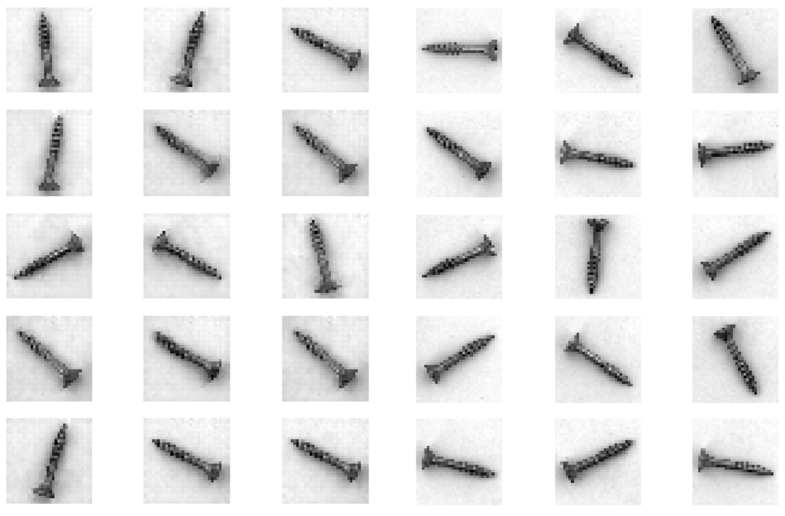

# Was macht eine Schraube zu einer Schraube?

Hier finden Sie Programmcode und Beispiele wie man Anomalien mithilfe von Generative Adversarial Networks erkennen kann.

Im Zuge dieses Use Cases wurde ein System implementiert, welches einschätzt, ob eine Schraube Beschädigungen aufweist und diese potentiellen Beschädigungen im Bild einzeichnet. Dabei trainieren wir vorab ein Generative Adversarial Network, Bilder von unbeschädigten Schrauben zu generieren. Die beiden resultierenden Modelle (Diskriminator und Generator) werden nach der Trainingssequenz wiederverwendet, um neue, unbekannte Bilder zu untersuchen. Die Idee hinter diesem Vorgehen ist in diesem [Paper](https://link.springer.com/chapter/10.1007/978-3-319-59050-9_12) beschrieben.

Die Grundlagen von Generative Adversarial Networks, sowie das genaue Vorgehen sind im [Notebook](./Notebook.ipynb) gezeigt. Wenn Sie den Beispielcode selbst testen wollen, finden Sie im [app Ordner](./app) die gesamte Applikation. In diesem Ordner sind auch mit dem Modell [generierte Beispielbilder](./app/generatedExampleImages) inkludiert.

__Durch Probleme in der Onlineansicht kann es vorkommen, dass die Bilder im Notebook hier auf Github nicht angezeigt werden. Sollte dies der Fall sein, können Sie sich den AIAV Ordner herunterladen und [Notebook.html](Notebook.html) lokal im Browser anzeigen lassen.__

# Der Use Case

DIe Implementierung basiert auf [Python 3](https://docs.python.org/3/) und verwendet [Intel PlaidML](https://github.com/plaidml/plaidml) sowie [Keras](https://keras.io/) zur Realisierung der Machine Learning Funktionen. PlaidML ist eine Machine Learning Bibliothek, welche Beschleunigung durch eine Grafikkarte auf Systemen verschiedener Hersteller ermöglicht. Dadurch, dass der Rechenaufwand für das Training des Generative Adversarial Networks relativ hoch ist, ist es nicht praktikabel das Training ohne Grafikkarte durchzuführen. [OpenCV](https://opencv.org/) und [Pillow](https://pillow.readthedocs.io/en/stable/) stellen Bildverarbeitungsfunktionen zur Verfügung, während [NumPy](https://numpy.org/) und [Matplotlib](https://matplotlib.org/) für Datenmanagement und Visualisierung verwendet werden.

Das Skript [*prepareWorkspace.sh*](./app/prepareWorkspace.sh) installiert automatisch alle benötigten Software Komponenten in einem Python 3 Virtual Environment, lädt die Trainingsdaten herunter und bearbeitet die Trainingsbilder vor. Das Skript führt dabei auch die Konfiguration von PlaidML durch, bei welcher Sie einfach den Anweisungen am Terminal folgen können. Dabei kann die Grafikkarte als Methode zur Beschleunigung des Trainings ausgewählt werden. Bitte beachten Sie, dass das Training selbst mit Grafikkarte mehrere Stunden dauert.

Anschließend kann das [trainModels.py](./app/trainModels.py) Python Skript ausgeführt werden, um das Generative Adversarial Network anhand der heruntergeladenen Bilder zu trainieren.

Nach erfolgreichem Training können sie das [anomalyDetection.py](./app/anomalyDetection.py) Skript ausführen, um ein Bild aus den Testdaten zu laden und auf Beschädigungen zu untersuchen. Die Ergebnisse werden vom Programm visualisiert.

Das Skript [*deleteWorkspace.sh*](./app/deleteWorkspace.sh) löscht den Workspace sowie alle heruntergeladenen und generierten Dateien.

__Achtung:__ Bitte führen Sie alle Skripten und Python Dateien im [app Ordner](./app) aus, damit alle Dateien richtig gefunden werden.

Folgende Systemvoraussetzungen müssen erfüllt sein, damit der Beispielcode ausgeführt werden kann:

- Python 3, Pip und Python Virtual Environments müssen installiert sein. Unter Windows werden diese drei Komponenten durch den [Python 3 Installer](https://www.python.org/downloads/windows/) installiert. Unter Linux werden sie mittels dem Befehl *sudo apt install python3 python3-pip python3-venv* installiert.

- Eine Internetverbindung zum Download der benötigten Komponenten.

- Installierte Grafikkarten Treiber mit OpenCL Unterstützung zur Beschleunigung des Trainings.

# Ergebnisse

Abbildung 1 zeigt echte sowie generierte Bilder von Schrauben. Die echten Bilder sind aus einem [offenen Datensatz](https://www.mvtec.com/company/research/datasets/mvtec-ad), während die generierten Bilder von einem, anhand diesen Datensatzes trainierten, Generative Adversarial Network erzeugt wurden. Die echten Bilder wurden dabei auf die gleiche Auflösung (32x32 Pixel) skaliert, wie die Bilder aus dem Generative Adversarial Network. Optisch sind die generierten von den echten Schrauben kaum unterscheidbar.

# Diskussion

In diesem Use Case haben wir uns mit dem Erzeugen von Bildern und darauf basierendem Erkennen von Anomalien beschäftigt. Dabei wurde gezeigt, dass man ein Generative Adversarial Network trainieren kann, Bilder von Schrauben zu erzeugen. Das Trainierte Modell wurde dann wiederverwendet, um Beschädigungen an Schrauben zu erkennen.

Generative Adversarial Networks erlauben es uns zu lernen, auch wenn nicht genug Daten für das Training von anderen Arten von Modellen vorhanden sind. Obwohl wir mit kleinen Neuronalen Netzwerken und einer niedrigen Auflösung von 32x32 Pixeln gearbeitet haben, war die benötigte Rechenleistung für das Training relativ hoch. Dafür sind GANs aber eine sehr flexible Lösung. Vor allem in Kombination mit anderen Verfahren aus AI erlauben sie es uns, praktische Probleme zu lösen, ohne zuerst eine große Menge an Trainingsdaten aufnehmen zu müssen.

