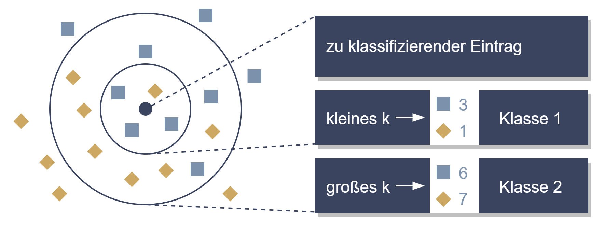

# Wie wir Grenzen finden

Hier finden sie Programmcode und Beispiele, wie man Klassifizierungsaufgaben mittels dem [k-Nearest Neighbour (kNN)](https://cs.nyu.edu/~roweis/papers/ncanips.pdf) Verfahren durchführen kann.

Im Zuge diese Use Cases verwenden wir kNN, um in einem Bild die Grenzen zwischen Vorder- und Hintergrund zu ermitteln. Dabei vergleichen wir ein vorab aufgenommenes Bild vom Hintergrund mit neuen Bildern. Basierend auf dem Vergleich klassifizieren wir jeden Bildpunkt mittels kNN, um Vorder- und Hintergrund klar zu trennen.

Die Grundlagen von kNN sowie das genaue Vorgehen sind Schritt für Schritt im [Notebook](./Notebook.ipynb) gezeigt. Wenn Sie den Beispielcode selbst testen wollen, finden Sie hier ein Skript (*buildandrun.sh*), welches die erforderlichen Komponenten in einem Python 3 Virtual Environment installiert und die Applikation mithilfe von inkludierten [Beispielbildern](./testImages) ausführt.

# Der Use Case

Die Implementierung basiert auf [Python 3](https://docs.python.org/3/) und verwendet [OpenCV](https://opencv.org/), [Pillow](https://pillow.readthedocs.io/en/stable/) und [Skimage](https://scikit-image.org/) zum Einlesen und Vorverarbeitung der Bilder. Die kNN Klassifizierung wird mittels [NumPy](https://numpy.org/) und der [Scikit Learn Bibliothek](https://scikit-learn.org/stable/) durchgeführt.

Das *buildandrun.sh* (*buildandrun.ps1* unter Windows) Skript erstellt ein Python Virtual Environment, installiert die benötigten Pakete in diesem und führt den Beispielcode aus. Folgende Systemvorraussetzungen müssen erfüllt sein, damit der Beispielcode ausgeführt werden kann:

- Python 3, Pip und Python Virtual Environments müssen installiert sein. Unter Windows werden diese drei Komponenten durch den [Python 3 Installer](https://www.python.org/downloads/windows/) installiert. Unter Linux werden sie mittels dem Befehl *sudo apt install python3 python3-pip python3-venv* installiert.

- Eine Internetverbindung zum Download der benötigten Komponenten.

# Ergebnisse

TODO

# Diskussion

In diesem Use Case haben wir uns mit dem Finden von Grenzen mithilfe von k-Nearest Neighbour (kNN) Klassifikatoren beschäftigt. Dabei wurde gezeigt, wie kNNs eingesetzt werden und wie verschiedene Werte für k den Ausgang der Klassifizierung beeinflussen können. kNNs ermöglichen durch ihre gute Performance und niedrigen Implementierungsaufwand effiziente Lösungen für Klassifizierungsprobleme.

