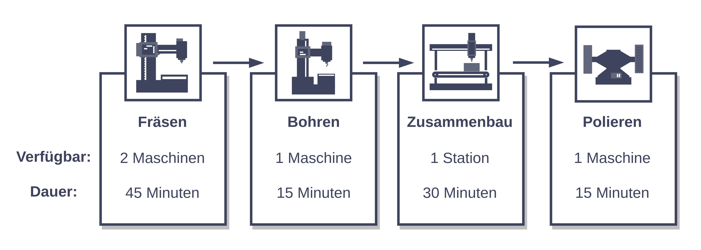
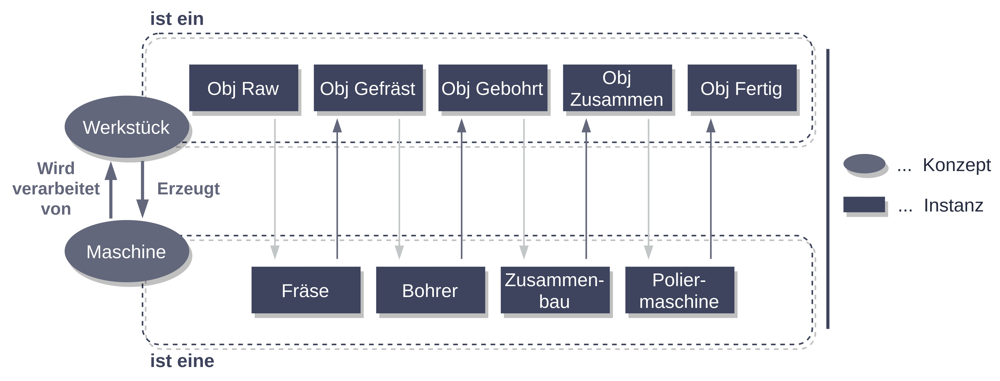

# Wir planen die Produktion mit Expertenwissen

Hier finden Sie Programmcode und Beispiele wie man eine Produktion mithilfe von [Logikprogrammierung](https://towardsdatascience.com/logic-programming-rethinking-the-way-we-program-8706b2adc3f1) und [Ontologien](https://towardsdatascience.com/knowledge-graphs-at-a-glance-c9119130a9f0) planen kann.

Im Zuge dieses Use Cases wurde ein System implementiert, welches einen Produktionsablauf (siehe Abbildung 1) mithilfe von Ontologien modelliert und mittels Logikprogrammierung plant. Dabei erstellen wir zunächst eine Ontologie, welche den Produktionsablauch als Instanzen der Konzepte Maschinen und Werkstücke beschreibt. Basierend auf der Ontologie werden dann Einschränkungen festgelegt, welche den Produktionsablauf beschreiben. Durch einen Boolean Satisfiability (SAT) Solver wir anschließend eine spezifische Lösung, also der zeitliche Ablauf der Produktion, ermittelt.

Die Grundlagen von Ontologien und Logikprogrammierung sind Schritt für Schritt im [Notebook](./Notebook.ipynb) erklärt. Wenn Sie den Beispielcode selbst testen wollen, finden Sie hier ein Skript (*buildandrun.sh*), welches die erforderlichen Komponenten in einem Python 3 Virtual Environment installiert und die Applikation ausführt.

__Durch Probleme in der Onlineansicht kann es vorkommen, dass die Bilder im Notebook hier auf Github nicht angezeigt werden. Sollte dies der Fall sein, können Sie sich den AIAV Ordner herunterladen und [Notebook.html](Notebook.html) lokal im Browser anzeigen lassen.__

# Der Use Case

Die Implementierung basiert auf [Python 3](https://docs.python.org/3/) und verwendet [Z3](https://github.com/Z3Prover/z3) zur Formulierung und Lösung der Einschränkungen sowie [Nupy](https://numpy.org/) für das Datenmanagement und [Matplotlib](https://matplotlib.org/) zur Visualiserung der Ergebnisse.

Das *buildandrun.sh* (*buildandrun.ps1* unter Windows) Skript erstellt ein Python Virtual Environment, installiert die benötigten Pakete in diesem und führt den Beispielcode aus. Folgende Systemvorraussetzungen müssen erfüllt sein, damit der Beispielcode ausgeführt werden kann:

- Python 3, Pip und Python Virtual Environments müssen installiert sein. Unter Windows werden diese drei Komponenten durch den [Python 3 Installer](https://www.python.org/downloads/windows/) installiert. Unter Linux werden sie mittels dem Befehl *sudo apt install python3 python3-pip python3-venv* installiert.

- Eine Internetverbindung zum Download der benötigten Komponenten.

# Ergebnisse

Abbildung 2 zeigt die aus der Aufgabenstellung resultierende Ontologie. Diese beschreibt den Produktionsablauf mittels den zwei Konzepten *Maschine* und *Werkstück*. Anhand dieser Ontologie bearbeiten wir die Anfrage, in welcher Beziehung das unbearbeitete und fertige Werkstück zueinander stehen. Die Antwort auf diese Anfrage beinhaltet sowohl Werkstücke als auch Maschinen und repräsentiert den Produktionsablauf. 

Anschließend werden die Einschränkungen basierend auf der verarbeiteten Anfrage erstellt und in einem Z3 Modell gespeichert. Dieses ermittelt eine spezifische Lösung, welche mittels Matplotlib als Zeitplan dargestellt wird (siehe Abbildung 3).

# Diskussion

In diesem Use Case haben wir uns mit der Darstellung von Expertenwissen als Ontologie und dem Formulieren eines Problems als logische Einschränkungen beschäftigt. Dabei wurde gezeigt, dass eine durch eine Ontologie beschriebene Problemstellung durch Logikprogrammierung gelöst werden kann.

