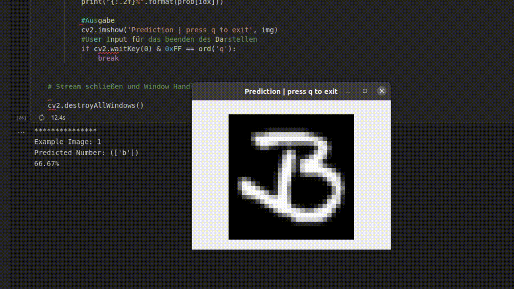

# k-Neares Neighbor 

Hier befindet sich der [Beispielcode](./miniUsecase15_RandomForest.ipynb) für das Implementieren einer Support Vector Machine. Der Use-Case befasst sich mit der Klassifizierung von Bildern. 

Genauer gesagt wollen wir handgeschriebene Buchstaben klassifizieren. Die Theorie des kNN Models ist im beiliegenden [Storyboard]() beschrieben.

# Bibliotheken
Die Implementierung ist erneut mittels der [scikit-learn](https://scikit-learn.org/stable/modules/generated/sklearn.neighbors.KNeighborsClassifier.html) Bibliothek in der Programmiersprache [Python](https://docs.python.org/3/) umgesetzt. Alle benötigten Bibliotheken sind in der [requirements-Datei](./requirements.txt) aufgelistet und können auch über diese installiert werden. Wie das genau funktioniert ist in diesem [Tutorial](https://note.nkmk.me/en/python-pip-install-requirements/) beschrieben. 

# Ordnerstruktur
 Das kNN Model benötigt - wie auch die anderen Modelle - zum Trainieren einen Datensatz an Bildern. Der Beispielcode ist so aufgebaut, dass innerhalb der vorgegebenen Ordnerstruktur einfach die Fotos getauscht werden können. So können individuelle Datensätze Trainiert werden. Im Ordner [data](./data) befinden die Unterordner, die gleichzeitig auch die Klassen vorgeben. Diese sind in unserem Fall die Buchstaben 'a' bis 'z'. Soll der Code für einen anderen Use-Case angepasst werden, so können einfach Ordnernamen und Bilder getauscht werden. 

# Ergebnisse
Das unten angeführte [GIF](./demo.gif) zeigt ein Beispielverhalten des Use-Cases. Es werden Bilder dem Model gezeigt. Dieses veruscht dann die Klasse herauszufinden und blendet das Ergebnis ein. 

Das Model hat eine Accuracy (Genauigkeit) von rund 87%. Ein typisches Storyboard hier auf der AIAV Seite hat rund 10000 Zeichen (ohne leerzeichen). Nehmen wir an die Storyboards bestehen nur aus Buchstaben und sind handschriftlich geschrieben. Das bedeutet, dass wir mit dem Modell ca 1300 Fehler machen würden, wenn wir den Text scannen würden. Das ist für eine Praxis Anwendung wahrscheinlich nicht ausreichend genug. 

# Was nun? 
In dem Use-Case haben wir uns mit der Klassifizierung von Bildern mittels der Support Vector Machine befasst. Wenn Sie weiteres Interesse an klassifizierungs Modellen haben, empfehlen wir folgende Use-Cases auf der Plattform. 

#### logistische Regression  
[Storyboard](http://www.aiav.technikum-wien.at/)  
[GitHub](https://github.com/TW-Robotics/AIAV/tree/devel_abdank/Logistische_Regression_fuer_Bildklassifizierung)  
### Support Vector Machine  
[Storyboard](http://www.aiav.technikum-wien.at/)  
[GitHub](https://github.com/TW-Robotics/AIAV/tree/devel_abdank/Support_Vector_Machine_fuer_Bildklassifizierung)  
#### Random Forest  
[Storyboard](http://www.aiav.technikum-wien.at/)  
[GitHub](https://github.com/TW-Robotics/AIAV/tree/devel_abdank/Random_Forest_fuer_Bildklassifizierung)

Ebenso haben wir angesprochen, dass die klassische Methode nicht immer ausreichend ist in der Praxis. Um dieses Problem zu lösen kann auf ein komplexeres Modell umgestellt werden wie zum Beispiel ein CNN. 
[Coming Soon]

 

# Weitere externe Informationen/Quellen
[Installieren von Bibliotheken mittels requirement.txt](https://note.nkmk.me/en/python-pip-install-requirements/)  

[Erstellen eines Dictionary für die verarbeitung der Trainingsbilder](https://kapernikov.com/tutorial-image-classification-with-scikit-learn/) 

[Implementierung einer PCA](https://medium.com/@sebastiannorena/pca-principal-components-analysis-applied-to-images-of-faces-d2fc2c083371) 

[Visualisierung einer PCA](https://jakevdp.github.io/PythonDataScienceHandbook/05.02-introducing-scikit-learn.html) 
 

[kNN Model Implementierungs Guide](https://rpubs.com/Sharon_1684/454441) 

[kNN Dokumentation](https://scikit-learn.org/stable/modules/generated/sklearn.neighbors.KNeighborsClassifier.html)