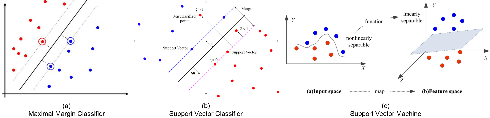

In dieser Reihe werde wir verschiedene maschinelle und Deep-Learning-Methoden vergleichen, um Kleidungsklassen anhand von Bildern des Fashion MNIST-Datensatzes zu erstellen bzw. mit dem erstellten Modellen zu klassifizieren. 
In diesem Beitrag werden wir sehen, wie Sie Support Vector Machines schätzen, die Ergebnisse aller Modelle vergleichen, die wir in dieser Beitragsserie gesehen haben, und alles zusammenfassen.


```{r setup, setup, message = FALSE, warning = FALSE, results = 'hide', echo = FALSE}
knitr::opts_chunk$set(echo = TRUE)
```

```{r, load libraries and prepare data-set, message = FALSE, warning = FALSE, results = 'hide', echo = FALSE}
library(devtools)
devtools::install_github("rstudio/keras")
library(keras)        
#install_keras()  
fashion_mnist = keras::dataset_fashion_mnist()
library(magrittr)
c(train.images, train.labels) %<-% fashion_mnist$train
c(test.images, test.labels) %<-% fashion_mnist$test
train.images = data.frame(t(apply(train.images, 1, c))) / max(fashion_mnist$train$x)
test.images = data.frame(t(apply(test.images, 1, c))) / max(fashion_mnist$train$x)
pixs = ncol(fashion_mnist$train$x)
names(train.images) = names(test.images) = paste0('pixel', 1:(pixs^2))
train.labels = data.frame(label = factor(train.labels))
test.labels = data.frame(label = factor(test.labels))
train.data = cbind(train.labels, train.images)
test.data = cbind(test.labels, test.images)
cloth_cats = c('Top', 'Trouser', 'Pullover', 'Dress', 'Coat',  
                'Sandal', 'Shirt', 'Sneaker', 'Bag', 'Boot')
train.classes = factor(cloth_cats[as.numeric(as.character(train.labels$label)) + 1])
test.classes = factor(cloth_cats[as.numeric(as.character(test.labels$label)) + 1])
```


```{r, load stats and prepare dataset 2, message = FALSE, warning = FALSE, echo = FALSE}
library(stats)
cov.train = cov(train.images)                      
pca.train = prcomp(cov.train)    
plotdf = data.frame(index = 1:(pixs^2), 
                    cumvar = summary(pca.train)$importance["Cumulative Proportion", ])
pca.dims = which(plotdf$cumvar >= .995)[1]
pca.rot = pca.train$rotation[, 1:pca.dims]  
train.images.pca = data.frame(as.matrix(train.images) %*% pca.rot)
test.images.pca  = data.frame(as.matrix(test.images) %*% pca.rot)
train.data.pca = cbind(train.images.pca, label = factor(train.data$label))
test.data.pca = cbind(test.images.pca, label = factor(test.data$label))
```


```{r, create performance function, message = FALSE, warning = FALSE, echo = FALSE}
model_performance = function(fit, trainX, testX, trainY, testY, model_name){
  
  # Predictions on train and test data for different types of models
  if (any(class(fit) == "rpart")){
    
    library(rpart)
    pred_train = predict(fit, newdata = trainX, type = "class")
    pred_test = predict(fit, newdata = testX, type = "class")
    
  } else if (any(class(fit) == "train")){
    
    library(data.table)
    pred_dt = as.data.table(fit$pred[, names(fit$bestTune)]) 
    names(pred_dt) = names(fit$bestTune)
    index_list = lapply(1:ncol(fit$bestTune), function(x, DT, tune_opt){
      return(which(DT[, Reduce(`&`, lapply(.SD, `==`, tune_opt[, x])), .SDcols = names(tune_opt)[x]]))
    }, pred_dt, fit$bestTune)
    rows = Reduce(intersect, index_list)
    pred_train = fit$pred$pred[rows]
    pred_test = predict(fit, newdata = testX)
    trainY = fit$pred$obs[rows]
    
  } else {
    
    print(paste0("Error: Function evaluation unknown for object of type ", class(fit)))
    break
    
  }
  
  # Performance metrics on train and test data
  library(MLmetrics)
  df = data.frame(accuracy_train = Accuracy(trainY, pred_train),
                  precision_train = Precision(trainY, pred_train),
                  recall_train = Recall(trainY, pred_train),
                  F1_train = F1_Score(trainY, pred_train), 
                  accuracy_test = Accuracy(testY, pred_test),
                  precision_test = Precision(testY, pred_test),
                  recall_test = Recall(testY, pred_test),
                  F1_test = F1_Score(testY, pred_test),
                  model = model_name)
  
  print(df)
  
  return(df)
}
```

# Support Vector Machine

Support Vector Machines (SVMs) bieten eine weitere Methode zur Klassifizierung der Kleidungskategorien in den Fashion MNIST-Daten. Um besser zu verstehen, was SVMs beinhalten, müssen wir einige komplexere Erklärungen durchgehen. Die folgende Abbildung kann Ihnen helfen, die verschiedenen Klassifikatoren zu verstehen, die ich in den nächsten Abschnitten besprechen werde (Abbildungen stammen von [hier](https://slideplayer.com/slide/3266197/), [hier](https://www. datasciencecentral.com/profiles/blogs/implementing-a-soft-margin-kernelized-support-vector-machine) und [hier](https://www.exlservice.com/optimizing-healthcare-analytics-by-choosing-the -richtiges Vorhersagemodell)).



Für eine $n \times p$-Datenmatrix und eine binäre Ergebnisvariable $y_i \in \{-1, 1\}$ ist eine Hyperebene ein flacher affiner Unterraum der Dimension $p - 1$, der den $p$-dimensionalen Raum in zwei Hälften teilt, definiert durch $\beta_0 + \beta_1 X_1 + \dots + \beta_p X_p$. Einer Beobachtung in den Testdaten wird eine Ergebnisklasse zugeordnet, je nachdem, auf welcher Seite der perfekt trennenden Hyperebene sie liegt, vorausgesetzt, dass eine solche Hyperebene existiert. Cutoff $t$ für den Wert einer Beobachtung $\hat{f}(X) = \hat{\beta}_1 X_1 + \hat{\beta}_2 X_2 + \dots + \hat{\beta}_p X_p$ bestimmt, welcher Klasse der Wert zugeordnet wird. Je weiter eine Beobachtung von der Hyperebene (bei Null) entfernt ist, desto sicherer ist sich der Klassifikator bezüglich der Klassenzuordnung. Falls vorhanden, können unendlich viele trennende Hyperebenen konstruiert werden. Eine gute Option in diesem Fall wäre die Verwendung des Maximal Margin Classifier (MMC), der den Rand um die Mittellinie des breitesten Streifens maximiert, der zwischen den beiden Ergebnisklassen eingefügt werden kann.

Wenn keine perfekt trennende Hyperebene existiert, können „fast trennende“ Hyperebenen mit Hilfe des Support Vector Classifier (SVC) verwendet werden. Der SVC erweitert die MMC, da Klassen nicht durch eine lineare Grenze trennbar sein müssen, indem Schlupfvariablen $\epsilon_i$ eingeschlossen werden, die es zulassen, dass einige Beobachtungen auf der falschen Seite des Randes oder der Hyperebene liegen. Das Ausmaß, in dem fehlerhafte Platzierungen vorgenommen werden, wird durch die Einstellung der Parameterkosten $C \geq \sum_{i=1}^{n} \epsilon_i$ bestimmt, wodurch der Bias-Varianz-Kompromiss gesteuert wird. Der SVC ist dem MMC vorzuziehen, da er aufgrund der größeren Margen sicherer in Klassenzuordnungen ist und eine größere Robustheit gewährleistet, da lediglich Beobachtungen am Rand oder eine Verletzung des Rands die Hyperebene beeinflussen.

Both MMCs and SVCs assume a linear boundary between the two classes of the outcome variable. Non-linearity can be addressed by enlarging the feature space using functions of predictors. Support vector machines combine SVCs with non-linear Kernels $K(x_i, x_{i'})$ (e.g. radial, polynomial or sigmoid) to achieve efficient computations. Kernels are generalizations of inner products that quantify the similarity of two observations (James et al., 2013). Usually, the radial Kernel is selected for non-linear models as it provides a good default Kernel in the absence of prior knowledge of invariances regarding translations. The radial Kernel is defined as $K(x_i, x_{i'})= \exp{(-\sigma \sum_{j=1}^{p} (x_{ij} - x_{i'j})^2)}$, where $\sigma$ is a positive constant that makes the fit more non-linear as it increases. Tuning $C$ and $\sigma$ is necessary to find the optimal trade-off between reducing the number of training errors and making the decision boundary more irregular (by increasing C). As SVMs only require the computation of $\bigl(\begin{smallmatrix} n\\ 2 \end{smallmatrix}\bigr)$ Kernels for all distinct observation pairs, they greatly improve efficiency. 

Sowohl MMCs als auch SVCs gehen von einer linearen Grenze zwischen den beiden Klassen der Ergebnisvariablen aus. Nichtlinearität kann behandelt werden, indem der Merkmalsraum unter Verwendung von Funktionen von Prädiktoren vergrößert wird. Support-Vektor-Maschinen kombinieren SVCs mit nichtlinearen (z. B. radialen, polynomialen oder sigmoiden) Kernel $K(x_i, x_{i'})$, um effiziente Berechnungen zu ermöglichen. Kernel sind Verallgemeinerungen der inneren Produkte, die die Ähnlichkeit zweier Beobachtungen quantifizieren. Normalerweise wird der radiale Kernel für nichtlineare Modelle ausgewählt, da dieser einen guten Standardkernel in Ermangelung vorheriger Kenntnisse von Invarianzen bezüglich Translationen liefert. Der radiale Kernel ist definiert als $K(x_i, x_{i'})= \exp{(-\sigma \sum_{j=1}^{p} (x_{ij} - x_{i'j})^2)}$, wobei $\sigma$ eine positive Konstante ist, die die Anpassung mit zunehmender Größe nichtlinearer macht. Das Abstimmen von $C$ und $\sigma$ ist notwendig, um den optimalen Kompromiss zwischen der Verringerung der Anzahl von Trainingsfehlern und der unregelmäßigeren Gestaltung der Entscheidungsgrenze (durch Erhöhen von C) zu finden. Da SVMs nur die Berechnung von $\bigl(\begin{smallmatrix} n\\ 2 \end{smallmatrix}\bigr)$ Kernels für alle unterschiedlichen Beobachtungspaare erfordern, verbessern sie die Effizienz erheblich.

SVMs können mit dem One-versus-one-Ansatz oder dem One-versus-all-Ansatz auf mehr als zwei Klassen erweitert werden. Im Fall von $K$-Klassen konstruiert die erstere $\bigl(\begin{smallmatrix} K\\ 2 \end{smallmatrix}\bigr)$ SVMs und ordnet Testbeobachtungen der Klasse zu, der sie in diesen $\bigl(\begin{smallmatrix} K\\ 2 \end{smallmatrix}\bigr)$-Klassifikatoren am häufigsten zugeordnet wurden. Letztere passt zu $K$ SVMs und vergleicht jedes Mal eine der $K$ Klassen mit den verbleibenden $K − 1$ Klassen, wobei jeder Beobachtung die Klasse zugeordnet wird, für die die Konfidenz, richtig zu sein, am höchsten ist.

Wie oben erwähnt, sind die Parameter, die abgestimmt werden müssen, die Kosten `C` und im Fall eines radialen Kernels die Nichtlinearitätskonstante `sigma`. Beginnen wir damit, diese Parameter mit einem zufälligen Suchalgorithmus abzustimmen, wobei wiederum das `caret`-Framework verwendet wird. Wir stellen die Steuerelemente so ein, dass sie eine 5-fache Kreuzvalidierung durchführen, und wir verwenden die Funktion `multiClassSummary()` aus der `MLmetrics`-Bibliothek, um eine Mehrklassenklassifizierung durchzuführen. Wir spezifizieren einen radialen Kernel, verwenden Genauigkeit als Leistungsmetrik1 und lassen den Algorithmus eine zufällige Suche nach dem Kostenparameter `C` über `pca.dims` (=17) zufälligen Werten durchführen. Beachten Sie, dass der Zufallssuchalgorithmus nur nach Werten von `C` sucht, während er einen konstanten Wert für `sigma` beibehält. Außerdem setzen wir im Gegensatz zu früheren Aufrufen von `trainControl()` jetzt `classProbs = FALSE`, da das Basispaket, das zum Schätzen von SVMs in `caret` und `kernlab` verwendet wird, aufgrund der Verwendung eines sekundären Regressionsmodells zu geringeren Genauigkeiten führt, wenn `classProbs = TRUE` angegeben wird.

```{r, load libraries and set train-control}
library(MLmetrics)
library(caret)
svm_control = trainControl(method = "repeatedcv",   
                            number = 5,  
                            repeats = 5, 
                            classProbs = FALSE,
                            allowParallel = TRUE, 
                            summaryFunction = multiClassSummary,
                           savePredictions = TRUE)
```

```{r, set random seed and train}
set.seed(815)
svm_rand_radial = train(label ~ ., 
                data = cbind(train.images.pca, label = train.classes),
                method = "svmRadial", 
                trControl = svm_control, 
                tuneLength = pca.dims,
                metric = "Accuracy")
svm_rand_radial
```


```{r, evaluate model performance}
mp.svm.rand.radial = model_performance(svm_rand_radial, train.images.pca, test.images.pca, 
                                       train.classes, test.classes, "svm_random_radial")
```

Die Ergebnisse zeigen, dass das Modell relativ hohe Genauigkeiten von 88 % bzw. 87 % bei den Trainings- und Testsätzen erreicht, wobei `sigma = 0.040` und `C = 32` als optimale Parameter ausgewählt wurden. Werfen wir einen Blick auf die Confusion-Matrix, um zu sehen, welche Kleidungskategorien am besten und welche am schlechtesten vorhergesagt werden, indem die Confusion-Matrix visualisiert wird. Zuerst berechnen wir die Vorhersagen für die Trainingsdaten, wie beim Definieren der bereits bekannten `model_performance`-Funktion.

```{r, confusion matrix}
library(data.table)
pred_dt = as.data.table(svm_rand_radial$pred[, names(svm_rand_radial$bestTune)]) 
names(pred_dt) = names(svm_rand_radial$bestTune)
index_list = lapply(1:ncol(svm_rand_radial$bestTune), function(x, DT, tune_opt){
  return(which(DT[, Reduce(`&`, lapply(.SD, `==`, tune_opt[, x])), .SDcols = names(tune_opt)[x]]))
}, pred_dt, svm_rand_radial$bestTune)
rows = Reduce(intersect, index_list)
pred_train = svm_rand_radial$pred$pred[rows]
trainY = svm_rand_radial$pred$obs[rows]
conf = table(pred_train, trainY)
```

Als Nächstes formen wir die Konfusionsmatrix in einen Datenmatrix mit drei Spalten um: eine für die wahren Kategorien (`trainY`), eine für die vorhergesagten Kategorien (`pred_train`) und eine für den Anteil korrekter Vorhersagen für die wahre Kategorie (`Freq`). Wir zeichnen dies als Kacheldiagramm mit einer blauen Farbskala, wobei hellere Werte einen größeren Anteil an Übereinstimmungen zwischen einer bestimmten Kombination aus wahren und vorhergesagten Kategorien anzeigen und dunklere Werte einen kleinen Anteil an Übereinstimmungen zwischen ihnen anzeigen. Beachten Sie, dass wir wieder das benutzerdefinierte Plotdesign `my_theme()` verwenden.

```{r, reshape confusion matrix}
library(ggplot2)
my_theme = function () { 
  theme_bw() + 
    theme(axis.text = element_text(size = 14),
          axis.title = element_text(size = 14),
          strip.text = element_text(size = 14),
          panel.grid.major = element_blank(), 
          panel.grid.minor = element_blank(),
          panel.background = element_blank(), 
          legend.position = "bottom",
          strip.background = element_rect(fill = 'white', colour = 'white'))
}
conf = data.frame(conf / rowSums(conf))
ggplot() + 
  geom_tile(data = conf, aes(x = trainY, y = pred_train, fill = Freq)) + 
  labs(x = "Actual", y = "Predicted", fill = "Proportion") +
  my_theme() +
  theme(axis.text.x = element_text(angle = 90, hjust = 1)) + 
   scale_fill_continuous(breaks = seq(0, 1, 0.25)) +
  coord_fixed()
```

Wir sehen aus diesem Diagramm, dass die meisten Klassen genau vorhergesagt werden, da sich das Hellblau (hohe Prozentsätze korrekter Vorhersagen) auf der Diagonale des Kacheldiagramms befinden. Wir können auch beobachten, dass die Kategorien, die am häufigsten verwechselt werden, Hemden, Tops, Pullover und Mäntel sind, was Sinn macht, da dies alles meist Oberkörperbekleidungsteile mit ähnlichen Formen sind. Das Modell sagt Hosen, Taschen, Stiefel und Turnschuhe gut voraus, da diese Zeilen und Spalten bis auf das diagonale Element besonders dunkel sind. Diese Ergebnisse stimmen mit denen aus dem Random Forest und den gradientenverstärkten Bäumen aus dem vorherigen Bbeitrag dieser Serie überein.

Als nächstes wiederholen wir den obigen Prozess zum Anpassen einer Support-Vektor-Maschine, aber anstelle einer zufälligen Suche nach den optimalen Parametern führen wir eine Gittersuche durch. Daher können wir Werte vorgeben, mit denen das Modell bewertet werden soll, nicht nur für `C`, sondern auch für `sigma`. Wir definieren die Gitterwerte in `svm_grid_radial`.

```{r repeat that but with grid search}
svm_grid_radial = expand.grid(sigma = c(.01, 0.04, 0.1), C = c(0.01, 10, 32, 70, 150))
set.seed(815)
svm_grid_radial = train(label ~ ., 
                              data = cbind(train.images.pca, label = train.classes),
                              method = "svmRadial", 
                              trControl = svm_control, 
                              tuneGrid = svm_grid_radial,
                              metric = "Accuracy")
svm_grid_radial
```

```{r, evaluate performance for grid search}
mp.svm.grid.radial = model_performance(svm_grid_radial, train.images.pca, test.images.pca, 
                                       train.classes, test.classes, "svm_grid_radial")
```

Die Rastersuche wählt die gleichen optimalen Parameterwerte wie die Zufallssuche (`C=32` und `sigma = 0.040`), was ebenfalls zu 88 % und 87 % Trainings- und Testgenauigkeit führt. Um eine Vorstellung davon zu bekommen, wie `C` und `sigma` die Genauigkeit des Trainingssatzes beeinflussen, zeichnen wir die Genauigkeit der Kreuzvalidierung als Funktion von `C` auf, wobei Linien für jeden Wert von `sigma` getrennt sind.

```{r, show results grid search finds the same as the random search}
ggplot() + 
  my_theme() +
  geom_line(data = svm_grid_radial$results, aes(x = C, y = Accuracy, color = factor(sigma))) +
  geom_point(data = svm_grid_radial$results, aes(x = C, y = Accuracy, color = factor(sigma))) +
  labs(x = "Cost", y = "Cross-Validation Accuracy", color = "Sigma") +
  ggtitle('Relationship between cross-validation accuracy and values of cost and sigma')
```

Das Diagramm zeigt, dass die grüne Linie (`sigma = 0.04`) die höchste Kreuzvalidierungsgenauigkeit für alle `C`-Werte aufweist, mit Ausnahme kleinerer `C`-Werte wie 0,01 und 10. Obwohl die Genauigkeit bei `C=10` und `sigma = 0.1` (blaue Linie ) dieser nahe kommt, ist die höchste erreichte Gesamtgenauigkeit für `C=32` und `sigma=32` (grüne Linie). Werfen wir auch einen Blick auf den Leistungsunterschied zwischen der Verwendung eines radialen und eines linearen Kernels. Denken Sie daran, dass wir für einen linearen Kernel nur mögliche Werte für den Kostenparameter `C` und nicht `sigma` angeben müssen, da es hier klarerweise keine Nichtlinearität gibt.

```{r, linear print}
svm_grid_linear = expand.grid(C = c(1, 10, 32, 75, 150))
set.seed(815)
svm_grid_linear = train(label ~ ., 
                              data = cbind(train.images.pca, label = train.classes),
                              method = "svmLinear", 
                              trControl = svm_control, 
                              tuneGrid = svm_grid_linear,
                              metric = "Accuracy")
svm_grid_linear
```


```{r, show performance of linear grid search}
mp.svm.grid.linear = model_performance(svm_grid_linear, train.images.pca, test.images.pca, 
                                       train.classes, test.classes, "svm_grid_linear")
```

Wir können die neu abgetasteten Genauigkeiten der SVMs auch visuell mit linearen und radialen Kernal-Spezifikationen mithilfe eines Boxplots vergleichen.
Dies ist möglich da wir vor dem Training beider Modelle denselben Random-Seed-Startwert festlegen.

```{r, compare the resampled accuacies}
resamp_val = resamples(list(svm_radial = svm_grid_radial, svm_linear = svm_grid_linear))
plotdf = data.frame(Accuracy = c(resamp_val$values$`svm_radial~Accuracy`, resamp_val$values$`svm_linear~Accuracy`),
                    Model = rep(c("Radial Kernel", "Linear Kernel"), rep(nrow(resamp_val$values), 2)))
ggplot() +
  geom_boxplot(data = plotdf, aes(x = Model, y = Accuracy)) +
  ggtitle('Resample accuracy for SVM with linear and radial Kernel') + 
  my_theme()
```

Obwohl die lineare Kernel-Spezifikation ebenfalls `C=32` auswählt, wie es die radiale Kernel-Spezifikation dies getan hat, schneidet sie schlechter ab als die radiale Kernel-Spezifikation ( 6 % ) sowohl bei der Trainings- als auch bei der Testsatzgenauigkeit. Daher sieht es so aus, als ob ein nichtlineares Modell bei der Klassifizierung der Fashion-MNIST-Daten besser abschneidet.

# Zusammenfassung

Vergleichen wir abschließend die Leistung aller Modelle, die wir uns angesehen haben, auch die der neuronalen Netze, die wir im ersten Bbeitrag dieser Serie entwickelt haben. Werfen wir einen Blick auf die Leistung der Modelle:

```{r, final results}
mp.df = rbind(mp.svm.rand.radial, mp.svm.grid.radial, mp.svm.grid.linear)
mp.df[order(mp.df$accuracy_test, decreasing = TRUE), ]
```

